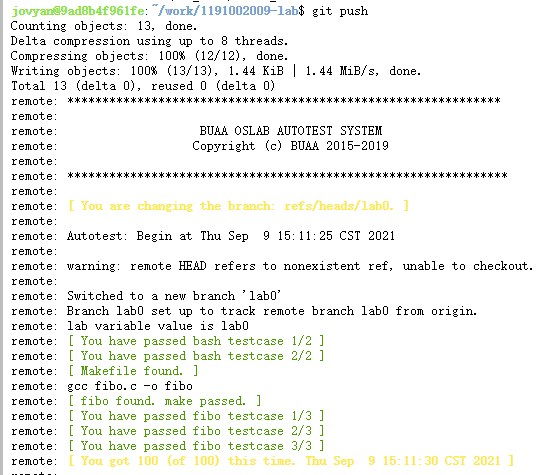

# lab0

## Exercise 0.1
```bash
$ echo "Hello Ubuntu"
Hello Ubuntu
$ bash -version
GNU bash, version 4.4.20(1)-release (x86_64-pc-linux-gnu)
Copyright (C) 2016 Free Software Foundation, Inc.
License GPLv3+: GNU GPL version 3 or later <http://gnu.org/licenses/gpl.html>

This is free software; you are free to change and redistribute it.
There is NO WARRANTY, to the extent permitted by law.
$ ls
guide-book.pdf  hello_world.ipynb work
```

## Thinking 0.1
CLI Shell的优势在于可以便捷而灵活地使用各种工具，但缺点是对于初学者并不友好，需要记住各种命令的使用。而GUI Shell的优势在于对初学者友好，只需要通过按钮的点击及图形化界面的交互即可使用，但缺点是不够灵活。

## Exercise 0.2
```bash
$ echo first
first
$ echo second > output.txt
$ echo third > output.txt
$ echo forth >> output.txt
$ cat output.txt
third
forth
```

## Thinking 0.2
`command` 文件的内容:
```bash
echo "\
echo Shell Start...
echo set a = 1
a=1
echo set b = 2
b=2
echo set c = a+b
c=\$[\$a+\$b]
echo c = \$c
echo save c to ./file1
echo \$c>file1
echo save b to ./file2
echo \$b>file2
echo save a to ./file3
echo \$a>file3
echo save file1 file2 file3 to file4
cat file1>file4
cat file2>>file4
cat file3>>file4
echo save file4 to ./result
cat file4>>result" > test
```

`result` 文件的内容:
```
3
2
1

```

## Exercise 0.3
`Untracked.txt`:
```
On branch master

No commits yet

Untracked files:
  (use "git add <file>..." to include in what will be committed)

	README.md
	Untracked.txt

nothing added to commit but untracked files present (use "git add" to track)
```

`Stage.txt`:
```
On branch master

No commits yet

Changes to be committed:
  (use "git rm --cached <file>..." to unstage)

	new file:   README.md

Untracked files:
  (use "git add <file>..." to include in what will be committed)

	Stage.txt
	Untracked.txt

```

`Modified.txt`:
```
On branch master

No commits yet

Changes to be committed:
  (use "git rm --cached <file>..." to unstage)

	new file:   README.md

Changes not staged for commit:
  (use "git add <file>..." to update what will be committed)
  (use "git checkout -- <file>..." to discard changes in working directory)

	modified:   README.md

Untracked files:
  (use "git add <file>..." to include in what will be committed)

	Modified.txt
	Stage.txt
	Untracked.txt

```

`Modified.txt` 与第一次add之前的status不一样，因为一旦有文件修改就会在这里显示出来。

## Thinking 0.3
|描述|命令|
|-|-|
|add the file|git add|
|stage the file|git add|
|commit|git commit|

## Thinking 0.4
* 使用 `git checkout` 来进行恢复
* 使用 `git reset HEAD printf.c` 来进行恢复
* 使用 `git rm --cached Tucao.txt` 来从暂存区删掉吐槽

## Exercise 0.4
`git log`:
```
commit f3c6c1811679a506cbd990a7056052a52f505cea (HEAD -> master)
Author: JiJi <i@mmdjiji.com>
Date:   Thu Sep 9 06:39:21 2021 +0000

    3

commit 437e966d154809e6e31de15f70793d5c51a9a891
Author: JiJi <i@mmdjiji.com>
Date:   Thu Sep 9 06:39:16 2021 +0000

    2

commit 4e60f8b94c19f61acf08e66773fea18ba446047e
Author: JiJi <i@mmdjiji.com>
Date:   Thu Sep 9 06:39:10 2021 +0000

    1
```
在 `git reset --hard 4e60f8b94c19f61acf08e66773fea18ba446047e` 后执行 `git log`:
```
commit 4e60f8b94c19f61acf08e66773fea18ba446047e (HEAD -> master)
Author: JiJi <i@mmdjiji.com>
Date:   Thu Sep 9 06:39:10 2021 +0000

    1
```
在 `git reset --hard f3c6c1811679a506cbd990a7056052a52f505cea` 后执行 `git log`:
```
commit f3c6c1811679a506cbd990a7056052a52f505cea (HEAD -> master)
Author: JiJi <i@mmdjiji.com>
Date:   Thu Sep 9 06:39:21 2021 +0000

    3

commit 437e966d154809e6e31de15f70793d5c51a9a891
Author: JiJi <i@mmdjiji.com>
Date:   Thu Sep 9 06:39:16 2021 +0000

    2

commit 4e60f8b94c19f61acf08e66773fea18ba446047e
Author: JiJi <i@mmdjiji.com>
Date:   Thu Sep 9 06:39:10 2021 +0000

    1
```

## Thinking 0.5
1. 正确。参考 https://github.com/git-guides/git-clone : When you clone a repository, you don't get one file, like you may in other centralized version control systems. By cloning with Git, you get the entire repository - all files, all branches, and all commits.
2. 正确。参考 https://stackoverflow.com/questions/30966942/does-git-require-an-internet-connection-to-work-locally
3. 错误，见 1 中参考
4. 并不总是master分支，只是HEAD指向的分支，有时也为main

## Exercise 0.5
```bash
$ git branch Test
$ git checkout Test
$ vim README.md
$ git add README.md
$ git commit -m "Initial commit"
$ git push
```

## Exercise 0.6

### 编写fibo.c
```c++
#include <stdio.h>

int fibo (int n) {
  int i;
  int a = 1, b = 1, c = 2;
  for(i=0; i<n; ++i) {
    printf("%d ", a);
    a = b;
    b = c;
    c = a + b;
  }
  return 0;
}

int main () {
  int var;
  scanf("%d", &var);
  fibo(var);
  return 0;
}
```

### 编写Makefile
```makefile
CC := gcc

.PHONY: all

all: fibo.c
	$(CC) fibo.c -o fibo
```

### 编写hello_os.sh
```bash
#!/bin/bash
sed -n 8p $1 > $2
sed -n 32p $1 >> $2
sed -n 128p $1 >> $2
sed -n 512p $1 >> $2
sed -n 1024p $1 >> $2
```

### 复制src到dst
```bash
cp src/* dst/ -r
```

### 上传提交代码
```bash
git add .
git commit -m "Finish lab0"
git push
```
得到以下内容:
```
remote: [ Congratulations! You have passed the current lab. ]
```
