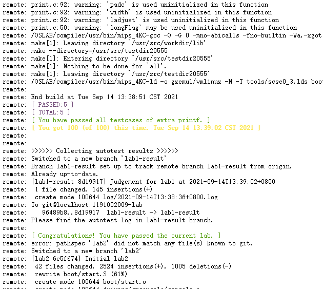

# lab1

## Exercise 1.1
将 `CROSS_COMPILE` 变量从 `bin/mips_4KC-` 修改为 `/opt/eldk/usr/bin/mips_4KC-` 即可。

> 需要注意的是，虽然本地修改为上述路径即可正常编译，但在评测系统上需要改成 `/OSLAB/compiler/usr/bin/mips_4KC-` 才能正常编译，因为远程环境与本地环境不一致。

```makefile
# Common includes in Makefile
#
# Copyright (C) 2007 Beihang University
# Written By Zhu Like ( zlike@cse.buaa.edu.cn )


CROSS_COMPILE :=  /opt/eldk/usr/bin/mips_4KC-
CC			  := $(CROSS_COMPILE)gcc
CFLAGS		  := -O -G 0 -mno-abicalls -fno-builtin -Wa,-xgot -Wall -fPIC
LD			  := $(CROSS_COMPILE)ld
```
`make`:
```bash
$ make
make --directory=boot
make[1]: Entering directory '/home/jovyan/work/1191002009-lab/boot'
/opt/eldk/usr/bin/mips_4KC-gcc -O -G 0 -mno-abicalls -fno-builtin -Wa,-xgot -Wall -fPIC -I../include/ -c start.S 
make[1]: Leaving directory '/home/jovyan/work/1191002009-lab/boot'
make --directory=drivers
make[1]: Entering directory '/home/jovyan/work/1191002009-lab/drivers'
make --directory=gxconsole
make[2]: Entering directory '/home/jovyan/work/1191002009-lab/drivers/gxconsole'
/opt/eldk/usr/bin/mips_4KC-gcc -O -G 0 -mno-abicalls -fno-builtin -Wa,-xgot -Wall -fPIC   -c -o console.o console.c
make[2]: Leaving directory '/home/jovyan/work/1191002009-lab/drivers/gxconsole'
make[1]: Leaving directory '/home/jovyan/work/1191002009-lab/drivers'
make --directory=init
make[1]: Entering directory '/home/jovyan/work/1191002009-lab/init'
/opt/eldk/usr/bin/mips_4KC-gcc  -O -G 0 -mno-abicalls -fno-builtin -Wa,-xgot -Wall -fPIC -I../include -c init.c
/opt/eldk/usr/bin/mips_4KC-gcc  -O -G 0 -mno-abicalls -fno-builtin -Wa,-xgot -Wall -fPIC -I../include -c main.c
make[1]: Leaving directory '/home/jovyan/work/1191002009-lab/init'
make --directory=lib
make[1]: Entering directory '/home/jovyan/work/1191002009-lab/lib'
/opt/eldk/usr/bin/mips_4KC-gcc -O -G 0 -mno-abicalls -fno-builtin -Wa,-xgot -Wall -fPIC -I./ -I../ -I../include/ -c print.c
print.c: In function 'lp_Print':
print.c:53: warning: unused variable 'prec'
print.c:77: warning: 'longFlag' is used uninitialized in this function
print.c:82: warning: 'padc' is used uninitialized in this function
print.c:82: warning: 'width' is used uninitialized in this function
print.c:82: warning: 'ladjust' is used uninitialized in this function
/opt/eldk/usr/bin/mips_4KC-gcc -O -G 0 -mno-abicalls -fno-builtin -Wa,-xgot -Wall -fPIC -I./ -I../ -I../include/ -c printf.c
make[1]: Leaving directory '/home/jovyan/work/1191002009-lab/lib'
/opt/eldk/usr/bin/mips_4KC-ld -o gxemul/vmlinux -N -T tools/scse0_3.lds boot/start.o init/main.o init/init.o drivers/gxconsole/console.o lib/*.o
```

## Exercise 1.2
```c++
// get section table addr, section header number and section header size.
ptr_sh_table = binary + ehdr->e_shoff;
sh_entry_count = ehdr->e_shnum;
sh_entry_size = ehdr->e_shentsize;

// for each section header, output section number and section addr.
for(Nr = 0; Nr < sh_entry_count; ++Nr) {
  shdr = (Elf32_Shdr *)ptr_sh_table;
  printf("%d:0x%x\n", Nr, shdr->sh_addr);
  ptr_sh_table += sh_entry_size;
}
```
然后使用 `make` 编译，之后拿 `testELF` 测试一下读取情况，可以发现一切正常:
```bash
$ ./readelf testELF 
0:0x0
1:0x8048154
2:0x8048168
3:0x8048188
4:0x80481ac
5:0x80481cc
6:0x804828c
7:0x804830e
8:0x8048328
9:0x8048358
10:0x8048360
11:0x80483b0
12:0x80483e0
13:0x8048490
14:0x804888c
15:0x80488a8
16:0x80488fc
17:0x8048940
18:0x8049f14
19:0x8049f1c
20:0x8049f24
21:0x8049f28
22:0x8049ff0
23:0x8049ff4
24:0x804a028
25:0x804a030
26:0x0
27:0x0
28:0x0
29:0x0
```
使用原生的 `readelf` 测试一下 `testELF`:
```bash
$ readelf -t testELF 
There are 30 section headers, starting at offset 0x1158:

Section Headers:
  [Nr] Name
       Type            Addr     Off    Size   ES   Lk Inf Al
       Flags
  [ 0] 
       NULL            00000000 000000 000000 00   0   0  0
       [00000000]: 
  [ 1] .interp
       PROGBITS        08048154 000154 000013 00   0   0  1
       [00000002]: ALLOC
  [ 2] .note.ABI-tag
       NOTE            08048168 000168 000020 00   0   0  4
       [00000002]: ALLOC
  [ 3] .note.gnu.build-id
       NOTE            08048188 000188 000024 00   0   0  4
       [00000002]: ALLOC
  [ 4] .gnu.hash
       GNU_HASH        080481ac 0001ac 000020 04   5   0  4
       [00000002]: ALLOC
  [ 5] .dynsym
       DYNSYM          080481cc 0001cc 0000c0 10   6   1  4
       [00000002]: ALLOC
  [ 6] .dynstr
       STRTAB          0804828c 00028c 000081 00   0   0  1
       [00000002]: ALLOC
  [ 7] .gnu.version
       VERSYM          0804830e 00030e 000018 02   5   0  2
       [00000002]: ALLOC
  [ 8] .gnu.version_r
       VERNEED         08048328 000328 000030 00   6   1  4
       [00000002]: ALLOC
  [ 9] .rel.dyn
       REL             08048358 000358 000008 08   5   0  4
       [00000002]: ALLOC
  [10] .rel.plt
       REL             08048360 000360 000050 08   5  12  4
       [00000002]: ALLOC
  [11] .init
       PROGBITS        080483b0 0003b0 00002e 00   0   0  4
       [00000006]: ALLOC, EXEC
  [12] .plt
       PROGBITS        080483e0 0003e0 0000b0 04   0   0 16
       [00000006]: ALLOC, EXEC
  [13] .text
       PROGBITS        08048490 000490 0003fc 00   0   0 16
       [00000006]: ALLOC, EXEC
  [14] .fini
       PROGBITS        0804888c 00088c 00001a 00   0   0  4
       [00000006]: ALLOC, EXEC
  [15] .rodata
       PROGBITS        080488a8 0008a8 000053 00   0   0  4
       [00000002]: ALLOC
  [16] .eh_frame_hdr
       PROGBITS        080488fc 0008fc 000044 00   0   0  4
       [00000002]: ALLOC
  [17] .eh_frame
       PROGBITS        08048940 000940 000104 00   0   0  4
       [00000002]: ALLOC
  [18] .ctors
       PROGBITS        08049f14 000f14 000008 00   0   0  4
       [00000003]: WRITE, ALLOC
  [19] .dtors
       PROGBITS        08049f1c 000f1c 000008 00   0   0  4
       [00000003]: WRITE, ALLOC
  [20] .jcr
       PROGBITS        08049f24 000f24 000004 00   0   0  4
       [00000003]: WRITE, ALLOC
  [21] .dynamic
       DYNAMIC         08049f28 000f28 0000c8 08   6   0  4
       [00000003]: WRITE, ALLOC
  [22] .got
       PROGBITS        08049ff0 000ff0 000004 04   0   0  4
       [00000003]: WRITE, ALLOC
  [23] .got.plt
       PROGBITS        08049ff4 000ff4 000034 04   0   0  4
       [00000003]: WRITE, ALLOC
  [24] .data
       PROGBITS        0804a028 001028 000008 00   0   0  4
       [00000003]: WRITE, ALLOC
  [25] .bss
       NOBITS          0804a030 001030 000008 00   0   0  4
       [00000003]: WRITE, ALLOC
  [26] .comment
       PROGBITS        00000000 001030 00002a 01   0   0  1
       [00000030]: MERGE, STRINGS
  [27] .shstrtab
       STRTAB          00000000 00105a 0000fc 00   0   0  1
       [00000000]: 
  [28] .symtab
       SYMTAB          00000000 001608 0004b0 10  29  46  4
       [00000000]: 
  [29] .strtab
       STRTAB          00000000 001ab8 000294 00   0   0  1
       [00000000]:
```

## Thinking 1.1
但是使用我们自己编译的 `readelf` 去测试 `vmlinux` ，发现失败了:
```bash
$ ./readelf vmlinux 
Segmentation fault (core dumped)
```

但是使用原生的就可以:
```bash
$ readelf -t vmlinux 
There are 14 section headers, starting at offset 0x8f6c:

Section Headers:
  [Nr] Name
       Type            Addr     Off    Size   ES   Lk Inf Al
       Flags
  [ 0] 
       NULL            00000000 000000 000000 00   0   0  0
       [00000000]: 
  [ 1] .text
       PROGBITS        00000000 000080 000950 00   0   0 16
       [00000007]: WRITE, ALLOC, EXEC
  [ 2] .reginfo
       MIPS_REGINFO    00000950 0009d0 000018 18   0   0  4
       [00000002]: ALLOC
  [ 3] .rodata.str1.4
       PROGBITS        00000968 0009e8 0000a2 01   0   0  4
       [00000032]: ALLOC, MERGE, STRINGS
  [ 4] .rodata
       PROGBITS        00000a10 000a90 000200 00   0   0 16
       [00000002]: ALLOC
  [ 5] .data
       PROGBITS        00000c10 000c90 000000 00   0   0 16
       [00000003]: WRITE, ALLOC
  [ 6] .data.stk
       PROGBITS        00000c10 000c90 008000 00   0   0  1
       [00000003]: WRITE, ALLOC
  [ 7] .bss
       NOBITS          00008c10 008c90 000000 00   0   0 16
       [00000003]: WRITE, ALLOC
  [ 8] .pdr
       PROGBITS        00000000 008c90 0001a0 00   0   0  4
       [00000000]: 
  [ 9] .mdebug.abi32
       PROGBITS        00000000 008e30 000000 00   0   0  1
       [00000000]: 
  [10] .comment
       PROGBITS        00000000 008e30 0000c8 00   0   0  1
       [00000000]: 
  [11] .shstrtab
       STRTAB          00000000 008ef8 000072 00   0   0  1
       [00000000]: 
  [12] .symtab
       SYMTAB          00000000 00919c 000250 10  13  24  4
       [00000000]: 
  [13] .strtab
       STRTAB          00000000 0093ec 0000c2 00   0   0  1
       [00000000]:
```

使用 `readelf -h vmlinux` 观察不同:
```
$ readelf -h vmlinux 
ELF Header:
  Magic:   7f 45 4c 46 01 02 01 00 00 00 00 00 00 00 00 00 
  Class:                             ELF32
  Data:                              2's complement, big endian
  Version:                           1 (current)
  OS/ABI:                            UNIX - System V
  ABI Version:                       0
  Type:                              EXEC (Executable file)
  Machine:                           MIPS R3000
  Version:                           0x1
  Entry point address:               0x0
  Start of program headers:          52 (bytes into file)
  Start of section headers:          36716 (bytes into file)
  Flags:                             0x50001001, noreorder, o32, mips32
  Size of this header:               52 (bytes)
  Size of program headers:           32 (bytes)
  Number of program headers:         2
  Size of section headers:           40 (bytes)
  Number of section headers:         14
  Section header string table index: 11
```
可以发现， `vmlinux` 是 `big endian` 的，而我们写的 `readelf` 只支持 `little endian` ，直接运行的话，地址会超出范围，故报错。

## Exercise 1.3
可以看到， `Kernel Text` 在 `0x80010000` ，因此只需在 `scse0_3.lds` 中把地址修改到这里即可。

```lds
/*To do:
  fill in the correct address of the key section
  such as text data bss ...
*/
  . = 0x80010000;
  .text : { *(.text) }
  .data : { *(.data) }
  .bss : { *(.bss) }
```

## Thinking 1.2
`main` 函数在 `init/main.c` 文件中，经过编译链接后，形成了一个整体，用 `j` 指令跳转到 `main` 函数即可。

## Exercise 1.4
根据 `incldue/mmu.h` 中的提示，栈顶地址为 `0x80400000` ，因此只需将栈顶设置过去，然后使用 `j` 指令跳转到 `main` 就行了。
```S
/*To do: 
  set up stack 
  you can reference the memory layout in the include/mmu.h
*/
  li sp, 0x80400000
  j main
```
用 `gxemul` 测试一下，发现是有输出的，但是输出并不正常，可能是并没有完善 `printf` 函数导致的:
```bash
$ gxemul -E testmips -C R3000 -M 64 gxemul/vmlinux
GXemul 0.4.6    Copyright (C) 2003-2007  Anders Gavare
Read the source code and/or documentation for other Copyright messages.

Simple setup...
    net: simulating 10.0.0.0/8 (max outgoing: TCP=100, UDP=100)
        simulated gateway: 10.0.0.254 (60:50:40:30:20:10)
            using nameserver 192.168.128.254
    machine "default":
        memory: 64 MB
        cpu0: R3000 (I+D = 4+4 KB)
        machine: MIPS test machine
        loading gxemul/vmlinux
        starting cpu0 at 0x80010000
-------------------------------------------------------------------------------

main.:  main imain.:    main is start ...

 s start ...

tart ...
```

## Exercise 1.5
补全扫描 `%` 相关逻辑:
```c++
    for(;;) {
  {
      /* scan for the next '%' */
      while(*fmt && *fmt != '%') {
        OUTPUT(arg, fmt, 1);
        ++fmt;
      }
      /* flush the string found so far */

      /* are we hitting the end? */
      if(!*fmt) break;
  }

  /* we found a '%' */
  ++fmt;
  
  /* check for long */
  if(*fmt == 'l') {
    longFlag = 1;
    ++fmt;
  }

  /* check for other prefixes */
```
运行测试如下:
```bash
$ gxemul -E testmips -C R3000 -M 64 gxemul/vmlinux
GXemul 0.4.6    Copyright (C) 2003-2007  Anders Gavare
Read the source code and/or documentation for other Copyright messages.

Simple setup...
    net: simulating 10.0.0.0/8 (max outgoing: TCP=100, UDP=100)
        simulated gateway: 10.0.0.254 (60:50:40:30:20:10)
            using nameserver 192.168.128.254
    machine "default":
        memory: 64 MB
        cpu0: R3000 (I+D = 4+4 KB)
        machine: MIPS test machine
        loading gxemul/vmlinux
        starting cpu0 at 0x80010000
-------------------------------------------------------------------------------

main.c: main is start ...

init.c: mips_init() is called

panic at init.c:24: ^^^^^^^^^^^^^^^^^^^^^^^^^^^^^^^^^^^^^

GXemul> quit
```

### 上传提交代码
```bash
git add .
git commit -m "Finish lab1"
git push
```
得到以下内容:
```
remote: [ Congratulations! You have passed the current lab. ]
```
