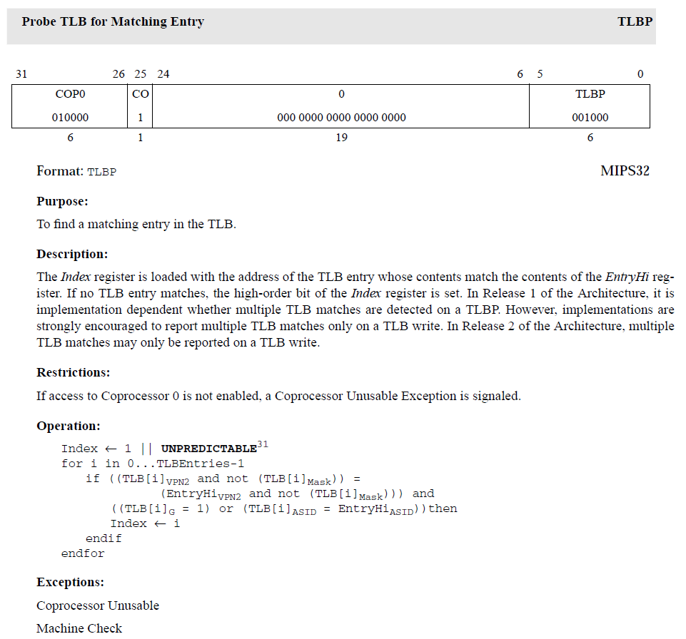
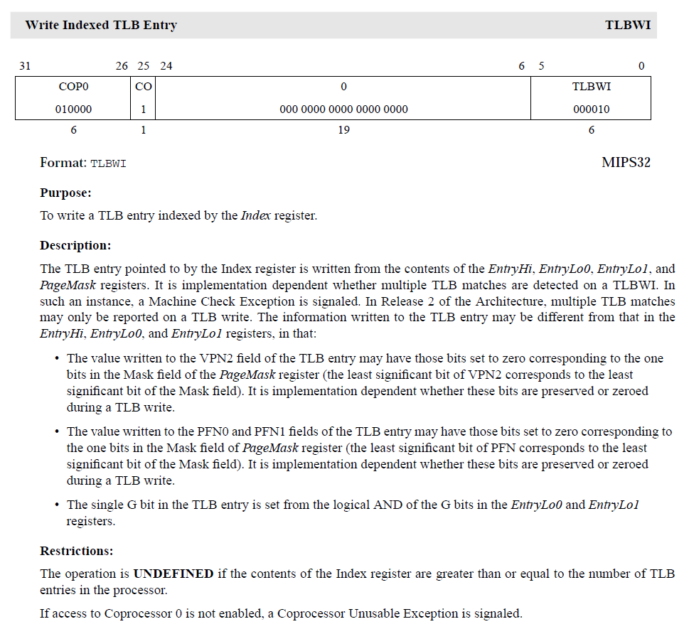
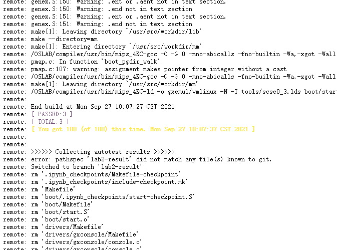

# lab2

## Thinking 2.1
首先，这种方式是具有可能性的。完全可以使用虚拟地址作为index去索引，但是需要注意的是会出现cache alias问题，因此需要在进程切换时对cache line进行invalidate的操作。（毕竟每个进程一个cache的想法也不现实）。这样做的好处肯定是速度快了，如果命中则不需要经过MMU；坏处就是增大了进程切换时的开销。（当然这样可能也不够现实，据我了解实际的做法是index用虚拟地址，tag用物理地址，最终也需要物理地址的确认才算命中，但是据说早起ARM架构就是用的传统方法，tag也用了虚拟地址）

物理地址查询的优势就是不会产生cache alias问题，不存在进程切换的开销，总体来说性能可能要更好。

## Thinking 2.2
查询TLB的同时并行地去查询MMU，如果TLB命中则终止查询MMU，没命中则同时去更新TLB和查cache。

## Thinking 2.3
x是一个虚拟地址。

## Thinking 2.4
当宏函数体写成 `do { /* ... */} while (0)` 如果结尾忘记加分号编译器会给出报错，这样能最大程度保证代码的行为一致性。如果写成 `{ /* ... */}` 的语句块，结尾没有加分号，也不会报错，这样的代码会非常蹩脚，即使没有产生什么问题，将来也会是莫名其妙的。

## Exercise 2.1
`LIST_INSERT_AFTER` 宏:
```c++
/*
 * Insert the element "elm" *after* the element "listelm" which is
 * already in the list.  The "field" name is the link element
 * as above.
 */
#define LIST_INSERT_AFTER(listelm, elm, field) do {                    \
                LIST_NEXT((elm), field) = LIST_NEXT((listelm), field); \
                if (LIST_NEXT((elm), field) != NULL)                   \
                    LIST_NEXT((listelm), field)->field.le_prev =       \
                        &LIST_NEXT((elm), field);                      \
                LIST_NEXT((listelm), field) = (elm);                   \
                (elm)->field.le_prev = &LIST_NEXT((listelm), field);   \
        } while (0)
        // Note: assign a to b <==> a = b
        //Step 1, assign elm.next to listelem.next.
        //Step 2: Judge whether listelm.next is NULL, if not, then assign listelm.pre to a proper value.
        //step 3: Assign listelm.next to a proper value.
        //step 4: Assign elm.pre to a proper value.
```
`LIST_INSERT_TAIL` 宏:
```c++
/*
 * Insert the element "elm" at the tail of the list named "head".
 * The "field" name is the link element as above. You can refer to LIST_INSERT_HEAD.
 * Note: this function has big differences with LIST_INSERT_HEAD !
 */
#define LIST_INSERT_TAIL(head, elm, field) do {                    \
                typeof(elm) tail;                                  \
                if (!LIST_FIRST(head)) {                           \
                    LIST_INSERT_HEAD(head, (elm), field);          \
                } else {                                           \
                    for (tail = LIST_FIRST(head);                  \
                         LIST_NEXT(tail, field);                   \
                         tail = LIST_NEXT(tail, field));           \
                    LIST_INSERT_AFTER(tail, (elm), field);         \
                }                                                  \
        } while (0)
/* finish your code here. */
```

## Thinking 2.5
内存页存储于物理内存，也就是内存颗粒中。

在 `pmap.h` 中有 `page2pa` 函数用来获取给定页的内存地址:
```c++
/* Get the physical address of Page 'pp'.
 */
static inline u_long
page2pa(struct Page *pp)
{
	return page2ppn(pp) << PGSHIFT;
}
```

## Thinking 2.6
`pmap.h` 中对 `Page_list` 最初的引用:
```c++
LIST_HEAD(Page_list, Page);
```
`queue.h` 中有对 `LIST_HEAD` 宏的定义:
```c++
#define LIST_HEAD(name, type)                                           \
        struct name {                                                           \
                struct type *lh_first;  /* first element */                     \
        }
```
展开得:
```c++
struct Page_list {
  struct Page *lh_first;
}
```
在 `pmap.h` 中存在对 `Page` 的定义:
```c++
typedef LIST_ENTRY(Page) Page_LIST_entry_t;

struct Page {
	Page_LIST_entry_t pp_link;	/* free list link */

	// Ref is the count of pointers (usually in page table entries)
	// to this page.  This only holds for pages allocated using
	// page_alloc.  Pages allocated at boot time using pmap.c's "alloc"
	// do not have valid reference count fields.

	u_short pp_ref;
};
```
在 `queue.h` 中找到 `LIST_ENTRY` 宏的定义:
```c++
#define LIST_ENTRY(type)                                                \
        struct {                                                                \
                struct type *le_next;   /* next element */                      \
                struct type **le_prev;  /* address of previous next element */  \
        }
```
展开得:
```c++
struct Page_list {
  struct {
    struct {
      struct Page *le_next;
      struct Page **le_prev;
    } pp_link;
    u_short pp_ref;
  } *lh_first;
};
```
因此选择选项C。

## Exercise 2.2
```c++
/* These variables are set by mips_detect_memory() */
u_long maxpa;            /* Maximum physical address */
u_long npage;            /* Amount of memory(in pages) */
u_long basemem;          /* Amount of base memory(in bytes) */
u_long extmem;           /* Amount of extended memory(in bytes) */
```

* 根据提示 `Set basemem to be 64MB, and calculate corresponding npage value.` 知需设置 `basemem` 为 `64MB` 。
* `npage` 物理页数，为 `maxpa` 除以页大小，由于此前已经描述过本次实验的页大小为 `4KB` ，此处就是 `maxpa / (4 * 1024)` 。
* `maxpa` 是最大物理地址，此处与 `basemem` 相等。
* `extmem` 是扩展内存，此处为 `0` 。

修改 `pmap.c` 如下:
```c++
/* Step 1: Initialize basemem.
  * (When use real computer, CMOS tells us how many kilobytes there are). */
basemem = 64 * 1024 * 1024; // 64MB
maxpa = basemem;
npage = maxpa / (4 * 1024);
extmem = 0;
```

## Thinking 2.7
此处b指针是一个虚拟地址。

`bzero` 函数:
```c++
void bzero(void *s, size_t n);
```
功能: 置字节字符串 `s` 的前 `n` 个字节为零且包括 `\0` 。

## Exercise 2.3
* 使用 `LIST_INIT` 宏来初始化链表
* 使用 `ROUND` 宏来进行地址对齐
* 使用 `PADDR` 宏将虚拟地址转换为物理地址
* 使用 `LIST_INSERT_HEAD` 完成空闲链表的前插
```c++
/*Overview:
 	Initialize page structure and memory free list.
 	The `pages` array has one `struct Page` entry per physical page. Pages
	are reference counted, and free pages are kept on a linked list.
  Hint:
	Use `LIST_INSERT_HEAD` to insert something to list.*/
void page_init(void) {
  /* Step 1: Initialize page_free_list. */
  /* Hint: Use macro `LIST_INIT` defined in include/queue.h. */
  LIST_INIT(&page_free_list);

  /* Step 2: Align `freemem` up to multiple of BY2PG. */
  freemem = ROUND(freemem, BY2PG);

  /* Step 3: Mark all memory blow `freemem` as used(set `pp_ref`
    * filed to 1) */
  u_long used = PADDR(freemem) / BY2PG;
  int i;
  for(i=0; i<used; ++i) {
    pages[i].pp_ref = 1;
  }

  /* Step 4: Mark the other memory as free. */
  for(i=used; i<npage; ++i) {
    pages[i].pp_ref = 0;
    LIST_INSERT_HEAD(&page_free_list, &pages[i], pp_link);
  }
}
```

## Exercise 2.4
完成 `page_alloc` 函数:
```c++
/*Overview:
	Allocates a physical page from free memory, and clear this page.

  Post-Condition:
	If failed to allocate a new page(out of memory(there's no free page)),
 	return -E_NO_MEM.
	Else, set the address of allocated page to *pp, and returned 0.

  Note:
 	Does NOT increment the reference count of the page - the caller must do
 	these if necessary (either explicitly or via page_insert).

  Hint:
	Use LIST_FIRST and LIST_REMOVE defined in include/queue.h .*/
int
page_alloc(struct Page **pp)
{
    struct Page *ppage_temp;

    /* Step 1: Get a page from free memory. If fails, return the error code.*/
    if(LIST_EMPTY(&page_free_list)) {
      return -E_NO_MEM;
    }
    ppage_temp = LIST_FIRST(&page_free_list);
    LIST_REMOVE(ppage_temp, pp_link);

    /* Step 2: Initialize this page.
     * Hint: use `bzero`. */
    bzero((void *)page2kva(ppage_temp), BY2PG);
    *pp = ppage_temp;
    return 0;
}
```
完成 `page_free` 函数:
```c++
/*Overview:
	Release a page, mark it as free if it's `pp_ref` reaches 0.
  Hint:
	When to free a page, just insert it to the page_free_list.*/
void
page_free(struct Page *pp)
{
    /* Step 1: If there's still virtual address refers to this page, do nothing. */
    if(pp->pp_ref == 1) {
      return;
    }

    /* Step 2: If the `pp_ref` reaches to 0, mark this page as free and return. */
    if(pp->pp_ref == 0) {
      LIST_INSERT_HEAD(&page_free_list, pp, pp_link);
      return;
    }

    /* If the value of `pp_ref` less than 0, some error must occurred before,
     * so PANIC !!! */
    panic("cgh:pp->pp_ref is less than zero\n");
}
```

在 `init/init.c` 的 `mips_init` 中注释掉 `page_check();` 后，重新 `make` 运行，结果如下:
```bash
$ gxemul -E testmips -C R3000 -M 64 gxemul/vmlinux
GXemul 0.4.6    Copyright (C) 2003-2007  Anders Gavare
Read the source code and/or documentation for other Copyright messages.

Simple setup...
    net: simulating 10.0.0.0/8 (max outgoing: TCP=100, UDP=100)
        simulated gateway: 10.0.0.254 (60:50:40:30:20:10)
            using nameserver 192.168.128.254
    machine "default":
        memory: 64 MB
        cpu0: R3000 (I+D = 4+4 KB)
        machine: MIPS test machine
        loading gxemul/vmlinux
        starting cpu0 at 0x80010000
-------------------------------------------------------------------------------

main.c: main is start ...

init.c: mips_init() is called

Physical memory: 65536K available, base = 65536K, extended = 0K

to memory 80401000 for struct page directory.

to memory 80431000 for struct Pages.

pmap.c:  mips vm init success

The number in address temp is 1000

physical_memory_manage_check() succeeded

panic at init.c:19: ^^^^^^^^^^^^^^^^^^^^^^^^^^^^^^^^^^^^^
```

这里得出一个经验，如果你什么时候在编译时遇到这种错误:
```bash
/OSLAB/compiler/usr/bin/mips_4KC-ld -o gxemul/vmlinux -N -T tools/scse0_3.lds boot/start.o init/main.o init/init.o drivers/gxconsole/console.o lib/*.o mm/*.o
lib/genex.o: In function `do_refill':
genex.S:(.data+0x21c): undefined reference to `mCONTEXT'
genex.S:(.data+0x220): undefined reference to `mCONTEXT'
lib/genex.o: In function `NOPAGE':
genex.S:(.data+0x2cc): undefined reference to `mCONTEXT'
genex.S:(.data+0x2d0): undefined reference to `mCONTEXT'
genex.S:(.data+0x2d8): undefined reference to `tlbra'
genex.S:(.data+0x2dc): undefined reference to `tlbra'
genex.S:(.data+0x2ec): undefined reference to `tlbra'
genex.S:(.data+0x2f0): undefined reference to `tlbra'
mm/pmap.o: In function `mips_vm_init':
pmap.c:(.text+0x18c): undefined reference to `mCONTEXT'
pmap.c:(.text+0x190): undefined reference to `mCONTEXT'
Makefile:30: recipe for target 'vmlinux' failed
make: *** [vmlinux] Error 1
```
不要慌，尝试 `make clean` 再 `make` ，可能是更改未充分被重新构建导致的。

## Thinking 2.8
不难算出 `0xC0000000` 这一地址对应的是第 `(0xC0000000 >> 12)` 个页表项，这个页表项也就是第一个页目录项。一个页表项32位，占用4个字节的内存，因此，其相对于页表起始地址 `0xC0000000` 的偏移为 `(0xC0000000 >> 12) * 4 = 0x00300000` ，于是得到地址为 `0xC0000000 + 0x00300000 = 0xC0300000` 。

## Exercise 2.5
`boot_pgdir_walk`:
```c++
/* Overview:
 	Get the page table entry for virtual address `va` in the given
 	page directory `pgdir`.
	If the page table is not exist and the parameter `create` is set to 1,
	then create it.*/
static Pte *boot_pgdir_walk(Pde *pgdir, u_long va, int create)
{

    Pde *pgdir_entryp;
    Pte *pgtable, *pgtable_entry;

    /* Step 1: Get the corresponding page directory entry and page table. */
    /* Hint: Use KADDR and PTE_ADDR to get the page table from page directory
     * entry value. */
    pgdir_entryp = &pgdir[PDX(va)];

    /* Step 2: If the corresponding page table is not exist and parameter `create`
     * is set, create one. And set the correct permission bits for this new page
     * table. */
    if(!(*pgdir_entryp & PTE_V) && create == 1) {
      *pgdir_entryp = PADDR((Pte)alloc(BY2PG, BY2PG, 1) | PTE_V);
    }

    /* Step 3: Get the page table entry for `va`, and return it. */
    pgtable = (Pte)KADDR((PTE_ADDR(*pgdir_entryp)));
    pgtable_entry = &pgtable[PTX(va)];
    return pgtable_entry;
}
```
`pgdir_walk`:
```c++
/*Overview:
 	Given `pgdir`, a pointer to a page directory, pgdir_walk returns a pointer
 	to the page table entry (with permission PTE_R|PTE_V) for virtual address 'va'.

  Pre-Condition:
	The `pgdir` should be two-level page table structure.

  Post-Condition:
 	If we're out of memory, return -E_NO_MEM.
	Else, we get the page table entry successfully, store the value of page table
	entry to *ppte, and return 0, indicating success.

  Hint:
	We use a two-level pointer to store page table entry and return a state code to indicate
	whether this function execute successfully or not.
    This function have something in common with function `boot_pgdir_walk`.*/
int
pgdir_walk(Pde *pgdir, u_long va, int create, Pte **ppte)
{
    Pde *pgdir_entryp;
    Pte *pgtable;
    struct Page *ppage;

    /* Step 1: Get the corresponding page directory entry and page table. */
    pgdir_entryp = &pgdir[PDX(va)];

    /* Step 2: If the corresponding page table is not exist(valid) and parameter `create`
     * is set, create one. And set the correct permission bits for this new page
     * table.
     * When creating new page table, maybe out of memory. */
    if(!(*pgdir_entryp & PTE_V) && create == 1) {
      if(page_alloc(&ppage) == -E_NO_MEM) return -E_NO_MEM;
      *pgdir_entryp = page2pa(ppage) | PTE_V | PTE_R;
      ppage->pp_ref = 1;
    }

    /* Step 3: Set the page table entry to `*ppte` as return value. */
    pgtable = (Pte*)KADDR(PTE_ADDR(*pgdir_entryp));
    Pte *pgtable_entry = &pgtable[PTX(va)];
    *ppte = pgtable_entry;

    return 0;
}
```

## Exercise 2.6
`boot_map_segment`:
```c++
/*Overview:
 	Map [va, va+size) of virtual address space to physical [pa, pa+size) in the page
	table rooted at pgdir.
	Use permission bits `perm|PTE_V` for the entries.
 	Use permission bits `perm` for the entries.

  Pre-Condition:
	Size is a multiple of BY2PG.*/
void boot_map_segment(Pde *pgdir, u_long va, u_long size, u_long pa, int perm)
{
    int i, va_temp;
    Pte *pgtable_entry;

    /* Step 1: Check if `size` is a multiple of BY2PG. */
    assert(size % BY2PG == 0);

    /* Step 2: Map virtual address space to physical address. */
    /* Hint: Use `boot_pgdir_walk` to get the page table entry of virtual address `va`. */
    for(i = 0; i < size; i += BY2PG) {
      va_temp = va + i;
      pgtable_entry = boot_pgdir_walk(pgdir, va_temp, 1);
      *pgtable_entry = (pa + i) | perm;
    }
}
```

## Exercise 2.7
`page_insert`:
```c++
/*Overview:
 	Map the physical page 'pp' at virtual address 'va'.
 	The permissions (the low 12 bits) of the page table entry should be set to 'perm|PTE_V'.

  Post-Condition:
    Return 0 on success
    Return -E_NO_MEM, if page table couldn't be allocated

  Hint:
	If there is already a page mapped at `va`, call page_remove() to release this mapping.
	The `pp_ref` should be incremented if the insertion succeeds.*/
int
page_insert(Pde *pgdir, struct Page *pp, u_long va, u_int perm)
{
    u_int PERM;
    Pte *pgtable_entry;
    PERM = perm | PTE_V;

    /* Step 1: Get corresponding page table entry. */
    pgdir_walk(pgdir, va, 0, &pgtable_entry);

    if (pgtable_entry != 0 && (*pgtable_entry & PTE_V) != 0) {
        if (pa2page(*pgtable_entry) != pp) {
            page_remove(pgdir, va);
        } else	{
            tlb_invalidate(pgdir, va);
            *pgtable_entry = (page2pa(pp) | PERM);
            return 0;
        }
    }

    /* Step 2: Update TLB. */
    /* hint: use tlb_invalidate function */
    *pgtable_entry = 0;
    tlb_invalidate(pgdir, va);

    /* Step 3: Do check, re-get page table entry to validate the insertion. */
    /* Step 3.1 Check if the page can be insert, if can’t return -E_NO_MEM */
    if (pgdir_walk(pgdir, va, 1, &pgtable_entry) != 0) {
      return -E_NO_MEM;
    }
    *pgtable_entry = page2pa(pp) | PERM;

    /* Step 3.2 Insert page and increment the pp_ref */
    ++pp->pp_ref;

    return 0;
}
```

## Thinking 2.9
### 流程解释
```asm
mfc0	k1,CP0_ENTRYHI // 保护寄存器CP0_ENTRYHI
mtc0	a0,CP0_ENTRYHI // 把a0放入寄存器CP0_ENTRYHI
nop
tlbp // 查找TLB是否有CP0_ENTRYHI寄存器匹配项，如有则放到CP0_INDEX里，没有则置CP0_INDEX最高位为1
nop
nop
nop
nop
mfc0	k0,CP0_INDEX // 把CP0_INDEX运到k0
bltz	k0,NOFOUND // 判断CP0_INDEX是不是小于0（也就是判断其最高位是否为1），如果为1跳NOFOUND
nop
```

### 查询MIPS手册
`tlbp` 指令的作用是寻找TLB中的匹配项:


`tlbwi` 指令的作用是从立即数寄存器写TLB:


### 为何4个nop指令
关于为何有4个nop指令，考虑可能是防止流水线CPU的冒险，人为地插入了bubble。

## Exercise 2.7
完成 `tlb_out` 函数:
```asm
#include <asm/regdef.h>
#include <asm/cp0regdef.h>
#include <asm/asm.h>

LEAF(tlb_out)
//1: j 1b
nop
	mfc0	k1,CP0_ENTRYHI
	mtc0	a0,CP0_ENTRYHI
	nop
	tlbp
	nop
	nop
	nop
	nop
	mfc0	k0,CP0_INDEX
	bltz	k0,NOFOUND
	nop
	mtc0	zero,CP0_ENTRYHI
	mtc0	zero,CP0_ENTRYLO0
	nop
	tlbwi
NOFOUND:

	mtc0	k1,CP0_ENTRYHI
	
	j	ra
	nop
END(tlb_out)
```
完成之后，重新 `make` ，执行测试如下:
```bash
$ gxemul -E testmips -C R3000 -M 64 gxemul/vmlinux
GXemul 0.4.6    Copyright (C) 2003-2007  Anders Gavare
Read the source code and/or documentation for other Copyright messages.

Simple setup...
    net: simulating 10.0.0.0/8 (max outgoing: TCP=100, UDP=100)
        simulated gateway: 10.0.0.254 (60:50:40:30:20:10)
            using nameserver 192.168.128.254
    machine "default":
        memory: 64 MB
        cpu0: R3000 (I+D = 4+4 KB)
        machine: MIPS test machine
        loading gxemul/vmlinux
        starting cpu0 at 0x80010000
-------------------------------------------------------------------------------

main.c: main is start ...

init.c: mips_init() is called

Physical memory: 65536K available, base = 65536K, extended = 0K

to memory 80401000 for struct page directory.

to memory 80431000 for struct Pages.

pmap.c:  mips vm init success

va2pa(boot_pgdir, 0x0) is 3ffe000

page2pa(pp1) is 3ffe000

start page_insert

pp2->pp_ref 0

end page_insert

page_check() succeeded!

panic at init.c:19: ^^^^^^^^^^^^^^^^^^^^^^^^^^^^^^^^^^^^^
```

### 上传提交代码
```bash
git add .
git commit -m "Finish lab2"
git push
```
得到以下内容:
```
remote: [ Congratulations! You have passed the current lab. ]
```


## Thinking 2.10
因为 `va` 的地址不是页面积的整数倍，而在 `va2pa` 的过程中，会被强制转化为物理页面的起始地址。低 `12` 位清零。所以在执行 `va = 0x88888` 的过程中，并没有把这个值赋到 `pa` 所在的位置，所以 `pa` 的值仍然是 `0` 。

## Thinking 2.11
`PSE` 开启时直接用连续的 `4MB` 储存 `1024` 个页表，通过高十位找到对应页表，再用接下来 `10` 位页表索引找到具体的物理页面。
