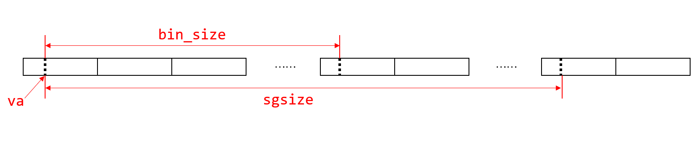

# lab3

## Exercise 3.1
```c++
/* Step 3, Allocate proper size of physical memory for global array `envs`,
 * for process management. Then map the physical address to `UENVS`. */
envs = (struct Env *)alloc(NENV * sizeof(struct Env), BY2PG, 1);
n = ROUND(NENV * sizeof(struct Env), BY2PG);
boot_map_segment(pgdir, UENVS, n, PADDR(envs), PTE_R);
```

## Exercise 3.2
```c++
/*Step 1: Initial env_free_list. */
LIST_INIT(&env_free_list);

/*Step 2: Travel the elements in 'envs', init every element(mainly initial its status, mark it as free)
  * and inserts them into the env_free_list as reverse order. */
for(i=NENV-1; i>=0; --i) {
  envs[i].env_status = ENV_FREE;
  LIST_INSERT_HEAD(&env_free_list, &envs[i], env_link);
}
```

## Thinking 3.1
也不是必须，但是这样有很多好处。插入空闲链表时最好逆序插入，这样完了之后链表头部对应的是 `envs[0]` ，在空闲链表使用时最先使用的也是 `envs[0]` ，这样的好处是最近使用过的放在头部，类似LRU算法，有助于提升效率。

## Exercise 3.3
```c++
int envid2env(u_int envid, struct Env **penv, int checkperm)
{
        struct Env *e;
    /* Hint:
 *      *  If envid is zero, return the current environment.*/
    /*Step 1: Assign value to e using envid. */
    if(envid == 0) {
      *penv = curenv;
      return 0;
    }
    
    e = envs + ENVX(envid);

    if (e->env_status == ENV_FREE || e->env_id != envid) {
      *penv = 0;
      return -E_BAD_ENV;
    }
    /* Hint:
 *      *  Check that the calling environment has legitimate permissions
 *           *  to manipulate the specified environment.
 *                *  If checkperm is set, the specified environment
 *                     *  must be either the current environment.
 *                          *  or an immediate child of the current environment.If not, error! */
    /*Step 2: Make a check according to checkperm. */

    if (checkperm && e != curenv && e->env_parent_id != curenv->env_id) {
      *penv = 0;
      return -E_BAD_ENV;
    }

    *penv = e;
    return 0;
}
```

## Thinking 3.2
```c++
u_int mkenvid(struct Env *e)
{
	static u_long next_env_id = 0;

    /*Hint: lower bits of envid hold e's position in the envs array. */
	u_int idx = e - envs;

    /*Hint:  high bits of envid hold an increasing number. */
	return (++next_env_id << (1 + LOG2NENV)) | idx;
}
```
低位通过进程块下标得到，高位是由一个持续增长的数来决定的。这样的好处是可以使进程ID唯一（如果只有低位那么在重复分配时就会重复），而且通过进程号的低 `1 + LOG2NENV` 位就能得到PCB的下标。

如果不判断 `e->env_id != envid` ，就可能导致原本未分配而为 `0` 的进程ID混入到正常的进程中。

## Exercise 3.4
```c++
static int
env_setup_vm(struct Env *e)
{
	int i, r;
	struct Page *p = NULL;
	Pde *pgdir;

  /*Step 1: Allocate a page for the page directory using a function you completed in the lab2.
    * and add its reference.
    *pgdir is the page directory of Env e, assign value for it. */
  if ((r = page_alloc(&p)) < 0) { /* Todo here*/
    panic("env_setup_vm - page alloc error\n");
    return r;
  }
  ++p->pp_ref;
  pgdir = (Pde *)page2kva(p);

  /*Step 2: Zero pgdir's field before UTOP. */
  for(i = 0; i < PDX(UTOP); ++i) {
    pgdir[i] = 0;
  }

  /*Step 3: Copy kernel's boot_pgdir to pgdir. */
  for(i = PDX(UTOP); i <= PDX(~0); ++i) {
    if(i != PDX(VPT) && i != PDX(UVPT)) { // except VPT and UVPT
      pgdir[i] = boot_pgdir[i];
    }
  }

  /* Hint:
    *  The VA space of all envs is identical above UTOP
    *  (except at VPT and UVPT, which we've set below).
    *  See ./include/mmu.h for layout.
    *  Can you use boot_pgdir as a template?
    */

  /*Step 4: Set e->env_pgdir and e->env_cr3 accordingly. */
  e->env_pgdir = pgdir;
  e->env_cr3 = PADDR(pgdir);

  /*VPT and UVPT map the env's own page table, with
   *different permissions. */
	e->env_pgdir[PDX(VPT)]   = e->env_cr3;
  e->env_pgdir[PDX(UVPT)]  = e->env_cr3 | PTE_V | PTE_R;
	return 0;
}
```

## Thinking 3.3
在进行拷贝时范围是 `PDX(UTOP)` 到 `PDX(~0)` ，很明显这基本就是内核态空间的位置，之所以需要拷贝 `boot_pgdir` 是为了让每个进程都有机会陷入到内核态从而访问对应的内核区域，要不然如果是空那进程陷入到内核态不就傻眼了吗。我猜测 `VPT` 和 `UVPT` 是不同进程不一样的，所以在这里留个坑，之后再设置。

参考 `mmu.h` 中的定义:
```c++
/*o      ULIM     -----> +----------------------------+------------0x8000 0000-------    
  o                      |         User VPT           |     PDMAP                /|\ 
  o      UVPT     -----> +----------------------------+------------0x7fc0 0000    |
  o                      |         PAGES              |     PDMAP                 |
  o      UPAGES   -----> +----------------------------+------------0x7f80 0000    |
  o                      |         ENVS               |     PDMAP                 |
  o  UTOP,UENVS   -----> +----------------------------+------------0x7f40 0000    |
  o  UXSTACKTOP -/       |     user exception stack   |     BY2PG                 | */
```

根据 `UTOP` 的定义:
```c++
#define UENVS (UPAGES - PDMAP)
#define UTOP UENVS
```

`ULIM` 是用户态空间和内核态空间的分界， `ULIM` 往下是用户态空间，往上是内核态空间，在我们实验中使用的是 `2G/2G` 模式，所以这里 `ULIM` 是 `0x80000000` 。而 `UTOP` 是用户可以使用的空间顶部，再往上的东西是 `UVPT` 和 `UPAGES` ，这些分别是 `boot_pgdir` 和 `pages` 的映射，指向了同一物理内存空间，但内核对 `UVPT` 与 `UPAGES` 设置了权限，用户只能读取，不可修改。

`CR3` 寄存器存储了页目录的物理地址，通过将 `env_cr3` 赋值给 `pgdir[PDX(UVPT)]` （页表中的某个地址，同时还作为页目录）可以完成页表的自映射，这样以后就能找到页目录了。

所有的物理地址都需要通过页表查询，每个进程的虚拟地址是相互隔离的，当进程切换时，虽然实际用的物理空间可能相同，但是通过页表的映射，让虚拟空间具有独立性，进程之间不会相互影响。

## Exercise 3.5
```c++
int
env_alloc(struct Env **new, u_int parent_id)
{
	int r;
	struct Env *e;
    
  /*Step 1: Get a new Env from env_free_list*/
  if(LIST_EMPTY(&env_free_list)) {
    *new = NULL;
    return -E_NO_FREE_ENV;
  }
  e = LIST_FIRST(&env_free_list);
  
  /*Step 2: Call certain function(has been implemented) to init kernel memory layout for this new Env.
    *The function mainly maps the kernel address to this new Env address. */
  r = env_setup_vm(e);
  if(r < 0) return r;

  /*Step 3: Initialize every field of new Env with appropriate values*/
  e->env_id = mkenvid(e);
  e->env_parent_id = parent_id;
  e->env_status = ENV_RUNNABLE;

  /*Step 4: focus on initializing env_tf structure, located at this new Env. 
    * especially the sp register,CPU status. */
  e->env_tf.cp0_status = 0x10001004;
  e->env_tf.regs[29] = USTACKTOP;

  /*Step 5: Remove the new Env from Env free list*/
  LIST_REMOVE(e, env_link);

  *new = e;
  return 0;
}
```

## Thinking 3.4
通过 `load_icode_mapper` 函数中的 `struct Env *env = (struct Env *)user_data;` 一行可知， `user_data` 是将来创建进程后的进程控制块(PCB)指针，显然没有这个参数就不行。

我认为这种设计就非常类似于 `int scanf(const char *__format, ...)` 的 `va_list` 内的参数，在调用前挖个坑分配好空间，在调用时对里面的内容进行操作，本来是要返回给用户的，但却无需显式返回。

## Exercise 3.6
注释里给出了提示， `va` 可能不是对齐于 `BY2PG` 的:



因此我们需要在分配页之前，以 `va` 的位置为基准做出调整，具体代码如下:
```c++
static int load_icode_mapper(u_long va, u_int32_t sgsize,
							 u_char *bin, u_int32_t bin_size, void *user_data)
{
	struct Env *env = (struct Env *)user_data;
	struct Page *p = NULL;
	u_long i;
	int r;
  Pde *pgdir = env->env_pgdir;
	u_long offset = va - ROUNDDOWN(va, BY2PG);
  if(offset > 0) { // va is not aligned by BY2PG
    page_alloc(&p);
    page_insert(pgdir, p, va, PTE_R);
    bcopy((void *)bin, (void *)(page2kva(p) + offset), BY2PG - offset);
    i = BY2PG - offset;
  }
	/*Step 1: load all content of bin into memory. */
  u_long tmpVa = ROUND(va, BY2PG);
	for (i; i < bin_size; i += BY2PG) {
		/* Hint: You should alloc a page and increase the reference count of it. */
    page_alloc(&p);
    page_insert(pgdir, p, tmpVa, PTE_R);
    bcopy(bin + i, page2kva(p), bin_size - i);
    tmpVa += BY2PG;
	}
  if(bin_size > i) {
    page_alloc(&p);
    page_insert(pgdir, p, tmpVa, PTE_R);
    bcopy(bin + i, page2kva(p), bin_size - i);
    i += BY2PG;
    tmpVa += BY2PG;
  }
	/*Step 2: alloc pages to reach `sgsize` when `bin_size` < `sgsize`.
    * i has the value of `bin_size` now. */
	while (i + BY2PG < sgsize) {
    page_alloc(&p);
    page_insert(pgdir, p, tmpVa, PTE_R);
    bzero(page2kva(p), BY2PG);
    i += BY2PG;
    tmpVa += BY2PG;
	}
  if(sgsize > i) {
    page_alloc(&p);
    page_insert(pgdir, p, tmpVa, PTE_R);
    bzero(page2kva(p), sgsize - 1);
  }
	return 0;
}
```

## Thinking 3.5
* `bin_size < BY2PG - offset`: ELF文件载入到页剩余位置后有内碎片
* `bin_size >= BY2PG - offset && (bin_size - BY2PG + offset) % BY2PG != 0`: ELF载入到页剩余位置后空间不够，又开了一页但是没用完，有内碎片
* `bin_size >= BY2PG - offset && (bin_size - BY2PG + offset) % BY2PG == 0`: ELF载入到页剩余位置后空间不够，又开了一页，恰好用完，无内碎片

## Exercise 3.7
根据调用关系，有 `load_icode -> load_elf -> load_icode_mapper` 。

先完成 `load_elf`:
```c++
while (ph_entry_count--) { // number of stacks
    phdr = (Elf32_Phdr *)ptr_ph_table;

    if (phdr->p_type == PT_LOAD) {
      /* Your task here!  */
      /* Real map all section at correct virtual address. Return < 0 if error. */
      /* Hint: Call the callback function you have achieved before. */
      r = map(phdr->p_vaddr, phdr->p_memsz, binary + phdr->p_offset, phdr->p_filesz, user_data);
      if(r < 0) {
        return r;
      }
    }
    ptr_ph_table += ph_entry_size;
  }
```

再完成 `load_icode`:
```c++
static void
load_icode(struct Env *e, u_char *binary, u_int size)
{
	/* Hint:
	 *  You must figure out which permissions you'll need
	 *  for the different mappings you create.
	 *  Remember that the binary image is an a.out format image,
	 *  which contains both text and data.
   */
	struct Page *p = NULL;
	u_long entry_point;
	u_long r;
  u_long perm = PTE_R;

  Pde *pgdir = e->env_pgdir;
  
  /*Step 1: alloc a page. */
  page_alloc(&p);
  
  /*Step 2: Use appropriate perm to set initial stack for new Env. */
  /*Hint: The user-stack should be writable? */
  page_insert(pgdir, p, USTACKTOP - BY2PG, perm);

  /*Step 3:load the binary by using elf loader. */
  load_elf(binary, size, &entry_point, (void *)e, load_icode_mapper);

  /***Your Question Here***/
  /*Step 4:Set CPU's PC register as appropriate value. */
	e->env_tf.pc = entry_point;
}
```

## Thinking 3.6
虚拟空间，因为如果是物理空间的话一般不能按顺序执行，`PC = PC + 4` 这种事就办不到了。

相同的，因为程序被载入到进程后，都存放在页表相同的位置。我刚开始把这个理解成ELF文件的入口点了。

如果是ELF文件的入口点应该是不同的，要不然这里为什么要用变量而不是一个常量呢？我觉得这种不统一可能是因为设计ELF文件的一种规范，在安排代码时没有必要把入口点放在特定的位置，只需要给出这个位置就可以了，使得ELF文件更加灵活。

为了验证我的猜想，我还做了个实验验证。

`vim hello_world.c`:
```c++
#include <stdio.h>
int main() {
  printf("Hello World!\n");
  return 0;
}
```

`vim hello_sekai.c`:
```c++
#include <stdio.h>
void little_japanese() {
  printf("little nihonjin: ");
}
int main() {
  printf("Hello sakai!\n");
  return 0;
}
```

```sh
gcc hello_world.c -o hello_world
gcc hello_sekai.c -o hello_sekai
readelf -h hello_world
readelf -h hello_sekai
```
观察两个程序的入口点地址，前者为 `0x1060` ，后者为 `0x1080` ，可见入口点应该和 `main` 函数位置(准确地说是 `_start` 子过程)有关。

## Exercise 3.8
`env_create_priority`:
```c++
void
env_create_priority(u_char *binary, int size, int priority)
{
  struct Env *e;
  /*Step 1: Use env_alloc to alloc a new env. */
  env_alloc(&e, 0);

  /*Step 2: assign priority to the new env. */
  e->env_pri = priority;

  /*Step 3: Use load_icode() to load the named elf binary. */
  load_icode(e, binary, size);

  /*Step 4: Use LIST_INSERT_HEAD to insert e to env_sched_list. */
  LIST_INSERT_HEAD(env_sched_list, e, env_sched_link);
}
```
`env_create`:
```c++
void
env_create(u_char *binary, int size)
{
	/*Step 1: Use env_create_priority to alloc a new env with priority 1 */
  env_create_priority(binary, size, 1);
}
```

## Exercise 3.9
```c++
void mips_init()
{
	printf("init.c:\tmips_init() is called\n");
	mips_detect_memory();
	
	mips_vm_init();
	page_init();
	
	env_init();
	env_check();

	/*you can create some processes(env) here. in terms of binary code, please refer current directory/code_a.c
	 * code_b.c*/
	/*you may want to create process by MACRO, please read env.h file, in which you will find it. this MACRO is very
	 * interesting, have fun please*/
  ENV_CREATE_PRIORITY(user_A, 2);
  ENV_CREATE_PRIORITY(user_B, 1);
	
	trap_init();
	kclock_init();
	panic("^^^^^^^^^^^^^^^^^^^^^^^^^^^^^^^^^^^^^");
	while(1);
	panic("init.c:\tend of mips_init() reached!");
}
```

## Thinking 3.7
设置为 `EPC` 寄存器的值，也就是 `env_tf.cp0_epc` ，这样进程切换时保存好上下文，等到返回的时候再把 `EPC` 寄存器的值赋回 `env_tf.pc` 就能继续运行了。

## Thinking 3.8
`TIMESTACK` 是发生时钟中断保护现场的栈顶指针。

在 `mmu.h` 中有如下宏定义:
```c++
#define TIMESTACK 0x82000000
```

在 `env.c` 中用到了 `TIMESTACK` ，这里拿它减去了 `sizeof(struct Trapframe)` ，得到的必然是个堆栈底部的地址，而这个堆栈就是保护现场的上下文。
```c++
/* Overview:
 *  Frees env e, and schedules to run a new env 
 *  if e is the current env.
 */
void
env_destroy(struct Env *e)
{
  /* Hint: free e. */
	env_free(e);

  /* Hint: schedule to run a new environment. */
	if (curenv == e) {
		curenv = NULL;
    /* Hint:Why this? */
		bcopy((void *)KERNEL_SP - sizeof(struct Trapframe),
			    (void *)TIMESTACK - sizeof(struct Trapframe),
			    sizeof(struct Trapframe));
		printf("i am killed ... \n");
		sched_yield();
	}
}
```

在 `stackframe.h` 中有一段 `get_sp` 函数可以获取栈顶的值，这里的地址是 `0x82000000` ，与 `TIMESTACK` 一致。
```asm
.macro get_sp
	mfc0	k1, CP0_CAUSE
	andi	k1, 0x107C
	xori	k1, 0x1000
	bnez	k1, 1f
	nop
	li	sp, 0x82000000
	j	2f
	nop
1:
	bltz	sp, 2f
	nop
	lw	sp, KERNEL_SP
	nop

2:	nop


.endm
```

在 `syscall_all.c` 中发现:
```c++
extern char *KERNEL_SP;
```
考虑 `KERNEL_SP` 可能是处理系统调用时的栈顶地址，而 `TIMESTACK` 是时钟中断时的栈顶地址。

## Exercise 3.10
```c++
void
env_run(struct Env *e)
{
	/*Step 1: save register state of curenv. */
  /* Hint: if there is a environment running, you should do
   *  context switch. You can imitate env_destroy() 's behaviors.*/
  if(curenv) {
    bcopy((void *)TIMESTACK - sizeof(struct Trapframe),
          &(curenv->env_tf),
          sizeof(struct Trapframe));
    curenv->env_tf.pc = curenv->env_tf.cp0_epc;
  }

  /*Step 2: Set 'curenv' to the new environment. */
  curenv = e;
  ++curenv->env_runs;

  /*Step 3: Use lcontext() to switch to its address space. */
  lcontext(e->env_pgdir);

  /*Step 4: Use env_pop_tf() to restore the environment's
    * environment registers and drop into user mode in the
    * the environment.
    */
  /* Hint: You should use GET_ENV_ASID there. Think why? */
  env_pop_tf(&(e->env_tf), GET_ENV_ASID(e->env_id));
}
```

完成这一步就可以开始测试了，我的测试结果如下:
```bash
$ gxemul -E testmips -C R3000 -M 64 gxemul/vmlinux
GXemul 0.4.6    Copyright (C) 2003-2007  Anders Gavare
Read the source code and/or documentation for other Copyright messages.

Simple setup...
    net: simulating 10.0.0.0/8 (max outgoing: TCP=100, UDP=100)
        simulated gateway: 10.0.0.254 (60:50:40:30:20:10)
            using nameserver 192.168.128.254
    machine "default":
        memory: 64 MB
        cpu0: R3000 (I+D = 4+4 KB)
        machine: MIPS test machine
        loading gxemul/vmlinux
        starting cpu0 at 0x80010000
-------------------------------------------------------------------------------

main.c: main is start ...

init.c: mips_init() is called

Physical memory: 65536K available, base = 65536K, extended = 0K

to memory 80401000 for struct page directory.

to memory 80431000 for struct Pages.

pmap.c:  mips vm init success

pe0->env_id 2048

pe1->env_id 4097

pe2->env_id 6146

env_init() work well!

envid2env() work well!

pe1->env_pgdir 83ffe000

pe1->env_cr3 3ffe000

env_setup_vm passed!

pe2`s sp register 7f3fe000

env_check() succeeded!

panic at init.c:28: ^^^^^^^^^^^^^^^^^^^^^^^^^^^^^^^^^^^^^

main.c: main is start ...

init.c: mips_init() is called

Physical memory: 65536K available, base = 65536K, extended = 0K

to memory 8046e000 for struct page directory.

to memory 8049e000 for struct Pages.

pmap.c:  mips vm init success

pe0->env_id 12288

pe1->env_id 14337

pe2->env_id 16386

panic at env.c:505: assertion failed: pe0->env_id == 2048
```

这里很神奇的是，到 `panic at init.c:28` 为止都是正常的，但是随后好像又执行了一个额外的 `mips_init()` 。我把 `panic` 提到 `kclock_init();` 前，额外的输出就没有了，而阅读指导书后文发现是有关 `kclock.c` 的内容，因此认为这里的 `failed` 在当前实验是正常的，需要等之后解决完中断与异常再来进行测试。

