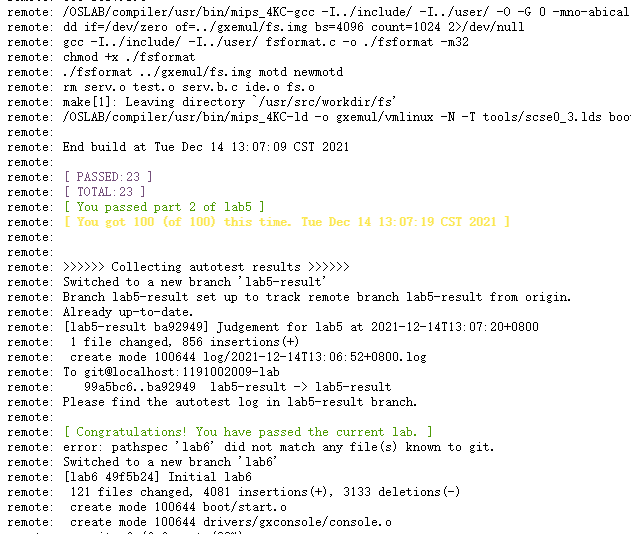

# lab5

## Thinking 5.1
`/proc` 文件系统是一种特殊的、由软件创建的文件系统，内核使用它向外界导出信息，/proc系统只存在内存当中，而不占用外存空间。

`/proc` 下面的每个文件都绑定于一个内核函数，用户读取文件时，该函数动态地生成文件的内容。也可以通过写 `/proc` 文件修改内核参数

`/proc` 目录下的文件分析 `/proc/$pid` 关于进程 `$pid` 的信息目录。每个进程在 `/proc` 下有一个名为其进程号的目录。例如 `$>strings -f /proc/[0-9]*/cmdline`

|文件|功能|
|-|-|
|/proc/cmdline|内核启动的命令行|
|/proc/cpuinfo|处理器信息，如类型、制造商、型号和性能。 |
|/proc/devices|列出字符和块设备的主设备号，以及分配到这些设备号的设备名称|
|/proc/dma|显示当前使用的DMA通道。 |
|/proc/filesystems|列出了可供使用的文件系统类型，通常是编入内核的文件系统类型，但可以通过模块加入新的类型|
|/proc/interrupts|显示使用的中断号，中断名称，以及这些中断从系统启动后产生的次数|
|/proc/ioports|当前使用的I/O端口。 |
|/proc/kallsyms|内核符号表。安装新的模块后，会在这里体现出来 |
|/proc/kcore|系统物理内存映象。与物理内存大小完全一样，但不实际占用这么多内存；(记住：除非拷贝到文件中，/proc下没有任何东西占用任何磁盘空间) |
|/proc/kmsg|内核输出的消息。也被送到syslog。 |
|/proc/loadavg|系统的平均负载，前3个是过去1分钟，5分钟，15分钟的负载，然后是正在运行的任务数和总任务数，最后是上次运行的进程号|
|/proc/meminfo|存储器使用信息，包括物理内存和swap。 |
|/proc/modules|当前加载了哪些核心模块。 |
|/proc/partitions|系统当前挂载硬盘的分区信息|
|/proc/pci|系统的pci总线信息|
|/proc/net|网络协议状态信息。 |
|/proc/self|到查看/proc的程序的进程目录的符号连接。当2个进程查看/proc时，是不同的连接。这主要便于程序得到它自己的进程目录。|
|/proc/slabinfo|系统中slab缓存的分配信息|
|/proc/stat|系统的一些状态信息|
|/proc/swaps|系统采用的交换区信息|
|/proc/sysrq-trigger|用于启动sysRq键|$>echo 1 > sysrq-trigger|
|/proc/uptime|系统启动的时间长度和空闲的时间长度。供uptime使用|
|/proc/version|内核版本|

Reference https://www.jb51.net/article/152879.htm

## Thinking 5.2
由于通过kseg0的读写用到了Cache，所以写回只有被置换的时候发生，就不具有了实时性，这么做会让那些具有实时性的设备出问题。

## Exercise 5.1
`lib/syscall_all.c`:
```c++
int sys_write_dev(int sysno, u_int va, u_int dev, u_int len) {
	int err = 1;
	if(dev >= 0x10000000 && dev + len - 1 < 0x10000020) err = 0;
	if(dev >= 0x13000000 && dev + len - 1 < 0x13004200) err = 0;
	if(dev >= 0x15000000 && dev + len - 1 < 0x15000200) err = 0;
	if(err) return -E_INVAL;
	dev += 0xA0000000;
	bcopy((void *)va, (void *)dev, len);
	return 0;
}

int sys_read_dev(int sysno, u_int va, u_int dev, u_int len) {
	int err = 1;
	if(dev >= 0x10000000 && dev + len - 1 < 0x10000020) err = 0;
	if(dev >= 0x13000000 && dev + len - 1 < 0x13004200) err = 0;
	if(dev >= 0x15000000 && dev + len - 1 < 0x15000200) err = 0;
	if(err) return -E_INVAL;
	dev += 0xA0000000;
	bcopy((void *)dev, (void *)va, len);
	return 0;
}
```
`user/lib.h`:
```c++
int syscall_write_dev(u_int va, u_int dev, u_int offset);
int syscall_read_dev(u_int va, u_int dev, u_int offset);
```
`user/syscall_lib.c`:
```c++
int syscall_write_dev(u_int va, u_int dev, u_int offset)
{
	return msyscall(SYS_write_dev, va, dev, offset, 0, 0);
}

int syscall_read_dev(u_int va,u_int dev,u_int offset)
{
	return msyscall(SYS_read_dev, va, dev, offset, 0, 0);
}
```

## Exercise 5.2
```c++
void
ide_read(u_int diskno, u_int secno, void *dst, u_int nsecs)
{
	// 0x200: the size of a sector: 512 bytes.
	int offset_begin = secno * 0x200;
	int offset_end = offset_begin + nsecs * 0x200;
	int offset = 0;
	int curoffset;
	while (offset_begin + offset < offset_end) {
		curoffset = offset_begin + offset;
		/* 1. 选择磁盘号, 即是往地址写值, 注意是4个字节 */
		if(syscall_write_dev(&diskno, 0x13000010, 4) < 0) {
			user_panic("Error in ide.c/ide_read 1\n");
		}
		/* 2. 设置磁盘读取位置的偏移offset */
		if(syscall_write_dev(&curoffset, 0x13000000, 4) < 0) {
			user_panic("Error in ide.c/ide_read 2\n");
		}
		/* 3. 写入0，表示开始读取, 注意是一个字节 */
		//char tmp = 0;
		int temp = 0;
		if(syscall_write_dev(&temp, 0x13000020, 4) < 0) {
			user_panic("Error in ide.c/ide_read 3\n");
		}
		/* 4. 读取磁盘操作结果*/
		int val;
		if(syscall_read_dev(&val, 0x13000030, 4) < 0){
			user_panic("Error in ide.c/ide_read 4\n");
		}
		if(val == 0) { // 失败了
			user_panic("Error in ide.c/ide_read 4 val = 0\n");
		}
		/* 5. 读出缓冲区里的内容 */
		if(syscall_read_dev(dst, 0x13004000, 512) < 0){
			user_panic("Error in ide.c/ide_read 5\n");
		}
		offset += 512;
		dst += 512;
		//offset_begin += 512;
	}
}

void
ide_write(u_int diskno, u_int secno, void *src, u_int nsecs)
{
  // Your code here
	int offset_begin = secno * 512;
	int offset_end = offset_begin + nsecs * 512;
	// int offset = ;
	writef("diskno: %d\n", diskno);
	while (offset_begin <  offset_end) {
		/* 1. 将数据写入缓冲区 */
		if(syscall_write_dev(src, 0x13004000, 512) < 0) {
			user_panic("Error in ide.c/ide_write 1\n");
		}
		/* 2. 选择磁盘号 */
		if(syscall_write_dev(&diskno, 0x13000010, 4) < 0) {
			user_panic("Error in ide.c/ide_write 2\n");
		} 
		/* 3. 设置磁盘写入位置的偏移 */
		if(syscall_write_dev(&offset_begin, 0x13000000, 4) < 0) {
			user_panic("Error in ide.c/ide_write 3\n");
		}
		/* 4. 写入1, 表示开始把缓冲区内容写入磁盘 */
		//char tmp = 1;
		int temp = 1;
		if(syscall_write_dev(&temp, 0x13000020, 4) < 0) {
			user_panic("Error in ide.c/ide_write 4\n");
		}
		/* 5. 读取磁盘操作结果 */
		int val;
		if(syscall_read_dev(&val, 0x13000030, 4) < 0){
			user_panic("Error in ide.c/ide_write 5\n");
		}
		if(val == 0) {
			user_panic("Error in ide.c/ide_write 5 val = 0\n");
		}
		src += 512;
		offset_begin += 512;
	}
}
```

## Exercise 5.3
```c++
void
free_block(u_int blockno)
{
	// Step 1: Check if the parameter `blockno` is valid (`blockno` can't be zero).
	if(blockno == 0) {
		user_panic("Error in fs.c/blockno can't be zero\n");
	}
	// Step 2: Update the flag bit in bitmap.
	bitmap[blockno / 32] |= (1 << (blockno % 32));
}
```
如果 `blockno` 为 `0` ，则 `bitmap[0]` 不能为 `1`。


## Thinking 5.3
4KB * 1024 = 4MB

## Thinking 5.4
根据 `include/fs.h`:
```c++
#define FILE2BLK	(BY2BLK/sizeof(struct File))
```
展开后 `FILE2BLK` 为 `16` ，即每个磁盘块下面最多有 `16` 个文件控制块 ，一个目录最多指向 `1024` 个磁盘块，所以一个目录最多有 `1024*16=16384` 个子文件。

## Exercise 5.4
```c++
struct File *create_file(struct File *dirf) {
    struct File *dirblk;
    int i, bno, found;
    int nblk = dirf->f_size / BY2BLK;
    if(nblk == 0) {
        return (struct File *)(disk[(make_link_block(dirf, nblk))].data);
    }
    if(nblk <= NDIRECT) {
        bno = dirf -> f_direct[nblk - 1];
    }else{
        bno = ((uint32_t *)(disk[dirf->f_indirect].data))[nblk - 1];
    }
    dirblk = (struct File *)disk[bno].data;
    for(i = 0; i < FILE2BLK; ++ i) {
        if(dirblk[i].f_name[0] == '\0') {
            return dirblk + i;
        }
    }
    return (struct File *)(disk[(make_link_block(dirf, nblk))].data);
}
```

## Thinking 5.5
地址范围 `0x10000000-0xcfffff` ，最大磁盘块大小为 `DISKMAX = 3MB` 。

## Exercise 5.5
```c++
u_int
diskaddr(u_int blockno)
{
	if(super && blockno > super->s_nblocks) {
		user_panic("Error: blockno is greater than disk's nblocks\n");
	}
	return (DISKMAP + blockno * BY2BLK);
}
```

## Exercise 5.6
```c++
int
map_block(u_int blockno)
{
	// Step 1: Decide whether this block is already mapped to a page of physical memory.
	if(block_is_mapped(blockno)) {
		return 0;
	}
	// Step 2: Alloc a page of memory for this block via syscall.
	return syscall_mem_alloc(0, diskaddr(blockno), PTE_V | PTE_R);
}

void
unmap_block(u_int blockno)
{
	int r;

	// Step 1: check if this block is mapped.
	if(!block_is_mapped(blockno)) {
		return;
	}

	// Step 2: if this block is used(not free) and dirty, it needs to be synced to disk,
	// can't be unmap directly.
	if(!block_is_free(blockno) && block_is_dirty(blockno)) {
		write_block(blockno);
	}

	// Step 3: use `syscall_mem_unmap` to unmap corresponding virtual memory.
	syscall_mem_unmap(0, diskaddr(blockno));

	// Step 4: validate result of this unmap operation.
	user_assert(!block_is_mapped(blockno));
}
```

## Exercise 5.7
```c++
int
dir_lookup(struct File *dir, char *name, struct File **file)
{
	int r;
	u_int i, j, nblock;
	void *blk;
	struct File *f;

	// Step 1: Calculate nblock: how many blocks this dir have.
	nblock = dir->f_size / BY2BLK;
	for (i = 0; i < nblock; ++i) {
		// Step 2: Read the i'th block of the dir.
		// Hint: Use file_get_block.
		r = file_get_block(dir, i, &blk);
		if(r < 0) return r;

		// Step 3: Find target file by file name in all files on this block.
		// If we find the target file, set the result to *file and set f_dir field.
		f = (struct File *)blk;
		for (j = 0; j < FILE2BLK; ++j) {
			if (strcmp(f[j].f_name, name) == 0) {
				*file = f + j;
				f[j].f_dir = dir;
				return 0;
			}
		}
	}

	return -E_NOT_FOUND;
}
```

## Thinking 5.6
根据 `user/fd.h`:
```c++
struct Filefd {
	struct Fd f_fd;
	u_int f_fileid;
	struct File f_file;
};
```
由于 `struct Filefd` 的第一个属性就是 `struct Fd` ，所以将 `struct Fd *` 转换为 `struct Filefd *` 时，无非就是将 `struct Filefd *` 的 `f_fd` 赋值好，和先定义出来一个 `struct Filefd *` 再去做赋值是一样的。

## Exercise 5.8
```c++
int
open(const char *path, int mode)
{
	struct Fd *fd;
	struct Filefd *ffd;
	u_int size, fileid;
	int r;
	u_int va;
	u_int i;

	// Step 1: Alloc a new Fd, return error code when fail to alloc.
	// Hint: Please use fd_alloc.
	r = fd_alloc(&fd);
	if(r < 0) return r;

	// Step 2: Get the file descriptor of the file to open.
	r = fsipc_open(path, mode, fd);
	if(r < 0) return r;

	// Step 3: Set the start address storing the file's content. Set size and fileid correctly.
	// Hint: Use fd2data to get the start address.
	ffd = fd;
	fileid = ffd->f_fileid;
	size = ffd->f_file.f_size;
	va = fd2data(fd);

	// Step 4: Map the file content into memory.
	for(i = 0; i < size; i += BY2PG) {
		fsipc_map(fileid, i, va + i);
	}

	// Step 5: Return file descriptor.
	// Hint: Use fd2num.
	return fd2num(fd);
}
```

## Exercise 5.9
```c++
int
read(int fdnum, void *buf, u_int n)
{
	int r;
	struct Dev *dev;
	struct Fd *fd;

	// Step 1: Get fd and dev.
	if((r = fd_lookup(fdnum, &fd)) < 0 || (r = dev_lookup(fd->fd_dev_id, &dev)) < 0) {
		return r;
	}

	// Step 2: Check open mode.
	if((fd->fd_omode & O_ACCMODE) == O_WRONLY) {
		writef("[%08x] read %d -- bad mode\n", env->env_id, fdnum);
		return -E_INVAL;
	}

	// Step 3: Read starting from seek position.
	r = (*dev->dev_read)(fd, buf, n, fd->fd_offset);

	// Step 4: Update seek position and set '\0' at the end of buf.
	if(r > 0) {
		fd->fd_offset += r;
		char *temp = buf;
		temp[r] = '\0';
	}
	return r;
}
```

## Thinking 5.7
```c++
struct File {
	u_char f_name[MAXNAMELEN];	// filename
	u_int f_size;			// file size in bytes
	u_int f_type;			// file type
	u_int f_direct[NDIRECT];
	u_int f_indirect;

	struct File *f_dir;		// the pointer to the dir where this file is in, valid only in memory.
	u_char f_pad[BY2FILE - MAXNAMELEN - 4 - 4 - NDIRECT * 4 - 4 - 4];
};
```
|属性|描述|
|-|-|
|f_name|文件名|
|f_size|文件大小|
|f_type|文件类型|
|f_direct|直接指针(10个)|
|f_indirect|间接指针|
|f_dir|目录地址|
|f_pad|填充，凑256Byte|

```c++
struct Fd {
	u_int fd_dev_id;
	u_int fd_offset;
	u_int fd_omode;
};
```
|属性|描述|
|-|-|
|fd_dev_id|外设id|
|fd_offset|打开偏移量(使用 `file.seek` 可以改变的那种)|
|fd_omode|打开方式(类似 `r`, `rw`, `r+`这种)|

```c++
struct Filefd {
	struct Fd f_fd;
	u_int f_fileid;
	struct File f_file;
};
```
|属性|描述|
|-|-|
|f_fd|struct Fd|
|f_fileid|文件id|
|f_file|struct File|

```c++
struct Open {
	struct File *o_file;	// mapped descriptor for open file
	u_int o_fileid;			// file id
	int o_mode;				// open mode
	struct Filefd *o_ff;	// va of filefd page
};
```
|属性|描述|
|-|-|
|o_file|struct File *|
|o_fileid|文件id|
|o_omode|打开方式(类似 `r`, `rw`, `r+`这种)|
|o_offset|打开偏移量(使用 `file.seek` 可以改变的那种)|

## Thinking 5.8
这个 `serve` 是一个用户进程，相当于提供服务的“后台进程”，它会在操作系统运行的时候一直提供文件的服务，所以就需要死循环。

## Exercise 5.10
`user/fsipc.c`:
```c++
int
fsipc_remove(const char *path)
{
	// Step 1: decide if the path is valid.
	if(strlen(path) > MAXPATHLEN) {
		return -E_BAD_PATH;
	}

	// Step 2: Send request to fs server with IPC.
	struct Fsreq_remove *req = (struct Fsreq_remove *)fsipcbuf;
	
	// Step 3: Copy path to path in req.
	strcpy((char *)req->req_path, path);

	// Step 4: Send request to fs server with IPC.
	int r = fsipc(FSREQ_REMOVE, req, 0, 0);
	return r;
}
```

`user/file.c`:
```c++
int
remove(const char *path)
{
	// Your code here.
	return fsipc_remove(path);
}
```

`fs/serv.c`:
```c++
void
serve_remove(u_int envid, struct Fsreq_remove *rq)
{
	int r;
	u_char path[MAXPATHLEN];

	// Step 1: Copy in the path, making sure it's terminated.
	user_bcopy(rq->req_path, path, MAXPATHLEN);
	path[MAXPATHLEN - 1] = '\0';

	// Step 2: Remove file from file system and response to user-level process.
	r = file_remove(path);
	if(r < 0) {
		ipc_send(envid, r, 0, 0);
	}
	ipc_send(envid, 0, 0, 0);
}
```

由于环境问题，编译前需要安装 `multilib` ，而且要安装版本 `4.8` 的（不然如果直接装 `gcc-multilib` 在 `make` 时会报不兼容）
```bash
$ sudo apt-get install gcc-4.8-multilib
```

而且还有坑，需要手动往 `lib/syscall.S` 中追加才能正常运行，否则 `va` 就变成 `0` 报超限:
```S
.word sys_write_dev
.word sys_read_dev
```

测试:
```bash
$ gxemul -E testmips -C R3000 -M 64 -d gxemul/fs.img gxemul/vmlinux
GXemul 0.4.6    Copyright (C) 2003-2007  Anders Gavare
Read the source code and/or documentation for other Copyright messages.

Simple setup...
    net: simulating 10.0.0.0/8 (max outgoing: TCP=100, UDP=100)
        simulated gateway: 10.0.0.254 (60:50:40:30:20:10)
            using nameserver 192.168.224.14
    machine "default":
        memory: 64 MB
        cpu0: R3000 (I+D = 4+4 KB)
        machine: MIPS test machine
        diskimage: gxemul/fs.img
            IDE DISK id 0, read/write, 4 MB (8192 sectors)
        loading gxemul/vmlinux
        starting cpu0 at 0x80010000
-------------------------------------------------------------------------------

main.c: main is start ...

init.c: mips_init() is called

Physical memory: 65536K available, base = 65536K, extended = 0K

to memory 80401000 for struct page directory.

to memory 80431000 for struct Pages.

pmap.c:  mips vm init success

panic at init.c:33: ^^^^^^^^^^^^^^^^^^^^^^^^^^^^^^^^^^^^^

pageout:        @@@___0x7f3fe000___@@@  ins a page 

pageout:        @@@___0x40d000___@@@  ins a page 

FS is running

FS can do I/O

superblock is good

diskno: 0

diskno: 0

read_bitmap is good

diskno: 0

alloc_block is good

file_open is good

file_get_block is good

file_flush is good

file_truncate is good

diskno: 0

file rewrite is good

pageout:        @@@___0x7f3fe000___@@@  ins a page 

pageout:        @@@___0x407000___@@@  ins a page 

serve_open 00000800 ffff000 0x2

open is good

read is good

diskno: 0

serve_open 00000800 ffff000 0x0

open again: OK

read again: OK

file rewrite is good

serve_open 00000800 ffff000 0x0

file remove: OK
```

## EOF
> 在提交前需要手动删除一下 `gxemul/fs.img` ，由于这个东西比较大， `git push` 的时候会出问题。

```bash
git add .
git commit -m "Finish lab5"
git push
```
得到以下内容:
```
remote: [ Congratulations! You have passed the current lab. ]
```
