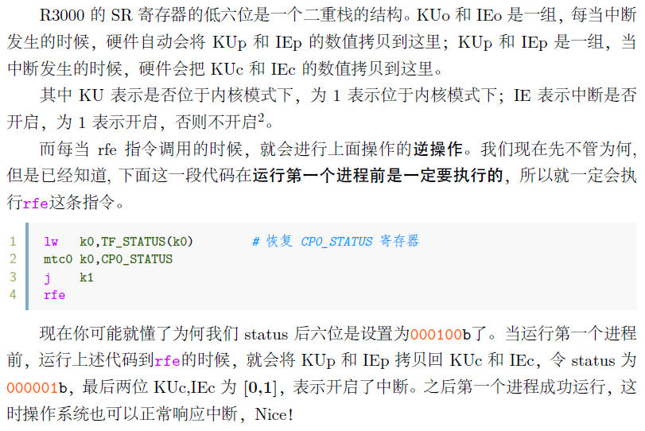

# lab6

## Thinking 6.1
把 `switch(fork())` 改为 `switch(!fork())` 即可:
```c++
#include <stdio.h>
#include <stdlib.h>
#include <unistd.h>

int fildes[2];
/* buf size is 100 */
char buf[100];
int status;

int main() {

  status = pipe(fildes);

  if (status == -1) {
    /* an error occurred */
    printf("error\n");
  }

  switch (!fork()) {
  case -1: /* Handle error */
    break;

  case 0:                                  /* Child - reads from pipe */
    close(fildes[1]);                      /* Write end is unused */
    read(fildes[0], buf, 100);             /* Get data from pipe */
    printf("father-process read:%s", buf); /* Print the data */
    close(fildes[0]);                      /* Finished with pipe */
    exit(EXIT_SUCCESS);

  default:                                 /* Parent - writes to pipe */
    close(fildes[0]);                      /* Read end is unused */
    write(fildes[1], "Hello world\n", 12); /* Write data on pipe */
    close(fildes[1]);                      /* Child will see EOF */
    exit(EXIT_SUCCESS);
  }
}
```

## Exercise 6.1
```c++
int fork(void)
{
  // Your code here.
  u_int newenvid;
  extern struct Env *envs;
  extern struct Env *env;
  u_int i;
  u_int r;

  set_pgfault_handler(pgfault);

  // u_int parent_id = syscall_getenvid(); // save the father process's id

  newenvid = syscall_env_alloc();
  if(newenvid == 0) { // child process
    env = envs + ENVX(syscall_getenvid());
    // env->env_parent_id = parent_id; [bug]
    return 0;
  }

  // Copy On Write
  for(i=0; i<USTACKTOP; i+=BY2PG) {
    if(((*vpd)[i >> PDSHIFT]) && ((*vpt)[i >> PGSHIFT])) {
      duppage(newenvid, VPN(i));
    }
  }

  // I don't know why it doesn't work successfully
  // for(i=0; i<VPN(USTACKTOP); ++i) {
  //   if(((*vpd)[i >> 10]) && ((*vpt)[i])) {
  //     duppage(newenvid, i);
  //   }
  // }
  
  if((r = syscall_mem_alloc(newenvid, UXSTACKTOP - BY2PG, PTE_V | PTE_R)) < 0) {
    return r;
  }
  if((r = syscall_set_pgfault_handler(newenvid,__asm_pgfault_handler, UXSTACKTOP)) < 0) {
    return r;
  }
  if((r = syscall_set_env_status(newenvid, ENV_RUNNABLE)) < 0) {
    return r; // [bug] `return r` is important, return other `E_` prefix value will cause error
  }
  return newenvid;
}
```

## Exercise 6.2
```c++
static int
piperead(struct Fd *fd, void *vbuf, u_int n, u_int offset)
{
	// Your code here.  See the lab text for a description of
	// what piperead needs to do.  Write a loop that 
	// transfers one byte at a time.  If you decide you need
	// to yield (because the pipe is empty), only yield if
	// you have not yet copied any bytes.  (If you have copied
	// some bytes, return what you have instead of yielding.)
	// If the pipe is empty and closed and you didn't copy any data out, return 0.
	// Use _pipeisclosed to check whether the pipe is closed.
	int i;
	struct Pipe *p;
	char *rbuf;

	p = (struct Pipe *)fd2data(fd);
	
	while(p->p_rpos >= p->p_wpos) {
		if(pipeisclosed(fd2num(fd))) return 0;
		syscall_yield();
	}
	for(i = 0; i < n; ++i, ++p->p_rpos) {
		while(p->p_rpos >= p->p_wpos) {
			if(pipeisclosed(fd2num(fd))) return i;
			syscall_yield();
		}
		((char *)vbuf)[i] = p->p_buf[p->p_rpos % BY2PIPE];
	}
	return i;

	user_panic("piperead not implemented");
//	return -E_INVAL;
}

static int
pipewrite(struct Fd *fd, const void *vbuf, u_int n, u_int offset)
{
	// Your code here.  See the lab text for a description of what 
	// pipewrite needs to do.  Write a loop that transfers one byte
	// at a time.  Unlike in read, it is not okay to write only some
	// of the data.  If the pipe fills and you've only copied some of
	// the data, wait for the pipe to empty and then keep copying.
	// If the pipe is full and closed, return 0.
	// Use _pipeisclosed to check whether the pipe is closed.
	int i;
	struct Pipe *p;
	char *wbuf;

	p = (struct Pipe *)fd2data(fd);
	
	while(p->p_wpos - p->p_rpos >= BY2PIPE) {
		if(pipeisclosed(fd2num(fd))) return 0;
		syscall_yield();
	}
	for(i = 0; i < n; ++i, ++p->p_wpos) {
		while(p->p_wpos - p->p_rpos >= BY2PIPE) {
			if(pipeisclosed(fd2num(fd))) return i;
			syscall_yield();
		}

		p->p_buf[p->p_wpos % BY2PIPE] = ((char *)vbuf)[i];
	}
	return i;

	user_panic("pipewrite not implemented");
//	return -E_INVAL;
	return n;
}

static int
_pipeisclosed(struct Fd *fd, struct Pipe *p)
{
	// Your code here.
	// 
	// Check pageref(fd) and pageref(p),
	// returning 1 if they're the same, 0 otherwise.
	// 
	// The logic here is that pageref(p) is the total
	// number of readers *and* writers, whereas pageref(fd)
	// is the number of file descriptors like fd (readers if fd is
	// a reader, writers if fd is a writer).
	// 
	// If the number of file descriptors like fd is equal
	// to the total number of readers and writers, then
	// everybody left is what fd is.  So the other end of
	// the pipe is closed.
	int pfd, pfp, runs;

	do {
		runs = env->env_runs;
		pfd = pageref(fd);
		pfp = pageref(p);
	} while(runs != env->env_runs);

	return pfd == pfp;

	user_panic("_pipeisclosed not implemented");
//	return 0;
}
```
测试 `testpipe` ，需要把 `init/init.c` 调成:
```c++
ENV_CREATE(user_testpipe);
ENV_CREATE(fs_serv);
```
测试正式开始:
```bash
$ gxemul -E testmips -C R3000 -M 64 -d gxemul/fs.img gxemul/vmlinux
GXemul 0.4.6    Copyright (C) 2003-2007  Anders Gavare
Read the source code and/or documentation for other Copyright messages.

Simple setup...
    net: simulating 10.0.0.0/8 (max outgoing: TCP=100, UDP=100)
        simulated gateway: 10.0.0.254 (60:50:40:30:20:10)
            using nameserver 192.168.224.14
    machine "default":
        memory: 64 MB
        cpu0: R3000 (I+D = 4+4 KB)
        machine: MIPS test machine
        diskimage: gxemul/fs.img
            IDE DISK id 0, read/write, 4 MB (8192 sectors)
        loading gxemul/vmlinux
        starting cpu0 at 0x80010000
-------------------------------------------------------------------------------

main.c: main is start ...

init.c: mips_init() is called

Physical memory: 65536K available, base = 65536K, extended = 0K

to memory 80401000 for struct page directory.

to memory 80431000 for struct Pages.

pmap.c:  mips vm init success

panic at init.c:40: ^^^^^^^^^^^^^^^^^^^^^^^^^^^^^^^^^^^^^

pageout:        @@@___0x7f3fe000___@@@  ins a page 

FS is running

FS can do I/O

superblock is good

pageout:        @@@___0x7f3fe000___@@@  ins a page 

[00000800] pipecreate 

diskno: 0

diskno: 0

read_bitmap is good

diskno: 0

alloc_block is good

file_open is good

file_get_block is good

file_flush is good

file_truncate is good

diskno: 0

file rewrite is good

[00000800] pipereadeof close 0

[00000800] pipereadeof write 1

[00001802] pipereadeof close 1

[00001802] pipereadeof readn 0


pipe read closed properly

[08x] destroying 08x

[08x] free env 08x

i am killed ... 

[00000800] pipecreate 

.................................

pipe write closed properly

pipe tests passed

[08x] destroying 08x

[08x] free env 08x

i am killed ... 

pipe tests passed

[08x] destroying 08x

[08x] free env 08x

i am killed ...
```
见两次 `pipe tests passed` ，测试通过。

## Thinking 6.2
```c++
int
dup(int oldfdnum, int newfdnum)
{
	int i, r;
	u_int ova, nva, pte;
	struct Fd *oldfd, *newfd;

	if ((r = fd_lookup(oldfdnum, &oldfd)) < 0) {
		return r;
	}

	close(newfdnum);
	newfd = (struct Fd *)INDEX2FD(newfdnum);
	ova = fd2data(oldfd);
	nva = fd2data(newfd);

	if ((r = syscall_mem_map(0, (u_int)oldfd, 0, (u_int)newfd,
							 ((*vpt)[VPN(oldfd)]) & (PTE_V | PTE_R | PTE_LIBRARY))) < 0) {
		goto err;
	}

	if ((* vpd)[PDX(ova)]) {
		for (i = 0; i < PDMAP; i += BY2PG) {
			pte = (* vpt)[VPN(ova + i)];

			if (pte & PTE_V) {
				// should be no error here -- pd is already allocated
				if ((r = syscall_mem_map(0, ova + i, 0, nva + i,
										 pte & (PTE_V | PTE_R | PTE_LIBRARY))) < 0) {
					goto err;
				}
			}
		}
	}

	return newfdnum;

err:
	syscall_mem_unmap(0, (u_int)newfd);

	for (i = 0; i < PDMAP; i += BY2PG) {
		syscall_mem_unmap(0, nva + i);
	}

	return r;
}
```

`dup` 函数会将一个文件描述符对应的内容映射到另一个文件描述符，并把文件内容映射过去。按原来的执行顺序，会先把文件描述页面映射，再映射文件内容，这样如果在文件内容没有映射完毕时进程被中断并替换，另一程序会因为文件描述页已经存在认为文件映射完成，从而造成错误。

## Thinking 6.3
系统调用是原子操作，参见 `include/stackframe.h`:
```S
.macro CLI
	mfc0	t0, CP0_STATUS
	li	t1, (STATUS_CU0 | 0x1)
	or	t0, t1
	xor	t0, 0x1
	mtc0	t0, CP0_STATUS
.endm
```
这里它设置了 `CP0` 寄存器的 `0x1` ，也就是 `KUc` 设置为了 `1` ，关闭了中断，等到系统调用结束才开启。

然后我提出了一个问题: 既然中断已经关掉，如何响应系统调用中的缺页中断？



是基于二重栈实现的！它挪一下中断就开了！

## Thinking 6.4
可以。未完成情况下 `pipe` 的 `pageref` 大于 `fd` 的 `pageref` ，先对 `fd` 进行 `unmap` 不会达成 `pipe` 的 `pageref` 与 `fd` 的 `pageref` 相等而导致退出，因而不会发生误判。

在 `dup` 中，如果我们先将 `pipe` 的 `pageref` 自增 (用 `syscall_mem_map` )，再将 `fd` 的 `pageref` 自增，那我们依然能够保持 `pageref(pipe) > pageref(fd)` ，故不会出现 `pageref(pipe) == pageref(fd)`而导致 `_pipeclosed` 误判的情况。

## Exercise 6.3
`user/pipe.c`:
```c++
static int
pipeclose(struct Fd *fd)
{
	syscall_mem_unmap(0, fd2data(fd));
	return 0;
}
```
`user/fd.c`:
```c++
int
dup(int oldfdnum, int newfdnum)
{
	int i, r;
	u_int ova, nva, pte;
	struct Fd *oldfd, *newfd;

	if ((r = fd_lookup(oldfdnum, &oldfd)) < 0) {
		return r;
	}

	close(newfdnum);
	newfd = (struct Fd *)INDEX2FD(newfdnum);
	ova = fd2data(oldfd);
	nva = fd2data(newfd);

	// if ((r = syscall_mem_map(0, (u_int)oldfd, 0, (u_int)newfd,
	// 						 ((*vpt)[VPN(oldfd)]) & (PTE_V | PTE_R | PTE_LIBRARY))) < 0) {
	// 	goto err;
	// }

	if ((* vpd)[PDX(ova)]) {
		for (i = 0; i < PDMAP; i += BY2PG) {
			pte = (* vpt)[VPN(ova + i)];

			if (pte & PTE_V) {
				// should be no error here -- pd is already allocated
				if ((r = syscall_mem_map(0, ova + i, 0, nva + i,
										 pte & (PTE_V | PTE_R | PTE_LIBRARY))) < 0) {
					goto err;
				}
			}
		}
	}

	if ((r = syscall_mem_map(0, (u_int)oldfd, 0, (u_int)newfd,
							 ((*vpt)[VPN(oldfd)]) & (PTE_V | PTE_R | PTE_LIBRARY))) < 0) {
		goto err;
	}

	return newfdnum;

err:
	syscall_mem_unmap(0, (u_int)newfd);

	for (i = 0; i < PDMAP; i += BY2PG) {
		syscall_mem_unmap(0, nva + i);
	}

	return r;
}
```

## Exercise 6.4
```c++
static int
_pipeisclosed(struct Fd *fd, struct Pipe *p)
{
	// Your code here.
	// 
	// Check pageref(fd) and pageref(p),
	// returning 1 if they're the same, 0 otherwise.
	// 
	// The logic here is that pageref(p) is the total
	// number of readers *and* writers, whereas pageref(fd)
	// is the number of file descriptors like fd (readers if fd is
	// a reader, writers if fd is a writer).
	// 
	// If the number of file descriptors like fd is equal
	// to the total number of readers and writers, then
	// everybody left is what fd is.  So the other end of
	// the pipe is closed.
	int pfd, pfp, runs;

	do {
		runs = env->env_runs;
		pfd = pageref(fd);
		pfp = pageref(p);
	} while(runs != env->env_runs);

	return pfd == pfp;

	user_panic("_pipeisclosed not implemented");
//	return 0;
}
```

## Thinking 6.5
ELF文件中记录了程序在文件中的大小与在内存中的大小，两者之差包含 `bss` 段大小。在装载入内存时把空间预留并清零即可。

## Thinking 6.6
文件是分段管理的，每段起始地址是固定的。

## Exercise 6.5
```c++
void runcmd(char *s) {
  char *argv[MAXARGS], *t;
  int argc, c, i, r, p[2], fd, rightpipe;
  int fdnum;
  rightpipe = 0;
  gettoken(s, 0);
again:
  argc = 0;
  for (;;) {
    c = gettoken(0, &t);
    switch (c) {
    case 0:
      goto runit;
    case 'w':
      if (argc == MAXARGS) {
        writef("too many arguments\n");
        exit();
      }
      argv[argc++] = t;
      break;
    case '<':
      if (gettoken(0, &t) != 'w') {
        writef("syntax error: < not followed by word\n");
        exit();
      }
      // Your code here -- open t for reading,
      // dup it onto fd 0, and then close the fd you got.
      r = open(t, O_RDONLY);
      if (r < 0) {
        writef("case '<' : open t failed\n");
        exit();
      }
      fd = r;
      dup(fd, 0);
      close(fd);
      // user_panic("< redirection not implemented");
      break;
    case '>':
      // Your code here -- open t for writing,
      // dup it onto fd 1, and then close the fd you got.
      if (gettoken(0, &t) != 'w') {
        writef("syntax error: > not followed by word\n");
        exit();
      }
      r = open(t, O_WRONLY);
      if (r < 0) {
        writef("case '>' : open t failed\n");
        exit();
      }
      fd = r;
      dup(fd, 1);
      close(fd);
      // user_panic("> redirection not implemented");
      break;
    case '|':
      // Your code here.
      // 	First, allocate a pipe.
      //	Then fork.
      //	the child runs the right side of the pipe:
      //		dup the read end of the pipe onto 0
      //		close the read end of the pipe
      //		close the write end of the pipe
      //		goto again, to parse the rest of the command line
      //	the parent runs the left side of the pipe:
      //		dup the write end of the pipe onto 1
      //		close the write end of the pipe
      //		close the read end of the pipe
      //		set "rightpipe" to the child envid
      //		goto runit, to execute this piece of the pipeline
      //			and then wait for the right side to finish
      r = pipe(p);
      if (r < 0) {
        writef("| not implemented (pipe)\n");
        exit();
      }
      r = fork();
      if (r < 0) {
        writef("| not implemented (fork)\n");
        exit();
      }
      if (r == 0) {
        dup(p[0], 0);
        close(p[0]);
        close(p[1]);
        goto again;
      } else {
        dup(p[1], 1);
        close(p[0]);
        close(p[1]);
        rightpipe = r;
        goto runit;
      }
      // user_panic("| not implemented");
      break;
    }
  }

runit:
  // debug = 1;
  if (argc == 0) {
    if (debug)
      writef("EMPTY COMMAND\n");
    return;
  }
  argv[argc] = 0;
  if (1) {
    writef("[%08x] SPAWN:", env->env_id);
    for (i = 0; argv[i]; i++)
      writef(" %s", argv[i]);
    writef("\n");
  }

  if ((r = spawn(argv[0], argv)) < 0)
    writef("spawn %s: %e\n", argv[0], r);
  close_all();
  if (r >= 0) {
    if (debug)
      writef("[%08x] WAIT %s %08x\n", env->env_id, argv[0], r);
    wait(r);
  }
  if (rightpipe) {
    if (debug)
      writef("[%08x] WAIT right-pipe %08x\n", env->env_id, rightpipe);
    wait(rightpipe);
  }

  exit();
}
```

测试 `testpiperace` ( `ENV_CREATE(user_testpiperace);` ):
```bash
$ gxemul -E testmips -C R3000 -M 64 -d gxemul/fs.img gxemul/vmlinux
GXemul 0.4.6    Copyright (C) 2003-2007  Anders Gavare
Read the source code and/or documentation for other Copyright messages.

Simple setup...
    net: simulating 10.0.0.0/8 (max outgoing: TCP=100, UDP=100)
        simulated gateway: 10.0.0.254 (60:50:40:30:20:10)
            using nameserver 192.168.224.14
    machine "default":
        memory: 64 MB
        cpu0: R3000 (I+D = 4+4 KB)
        machine: MIPS test machine
        diskimage: gxemul/fs.img
            IDE DISK id 0, read/write, 4 MB (8192 sectors)
        loading gxemul/vmlinux
        starting cpu0 at 0x80010000
-------------------------------------------------------------------------------

main.c: main is start ...

init.c: mips_init() is called

Physical memory: 65536K available, base = 65536K, extended = 0K

to memory 80401000 for struct page directory.

to memory 80431000 for struct Pages.

pmap.c:  mips vm init success

panic at init.c:40: ^^^^^^^^^^^^^^^^^^^^^^^^^^^^^^^^^^^^^

pageout:        @@@___0x7f3fe000___@@@  ins a page 

FS is running

FS can do I/O

superblock is good

pageout:        @@@___0x7f3fe000___@@@  ins a page 

testing for dup race...

[00000800] pipecreate 

diskno: 0

diskno: 0

read_bitmap is good

diskno: 0

alloc_block is good

file_open is good

file_get_block is good

file_flush is good

file_truncate is good

diskno: 0

file rewrite is good

pid is 6146

kid is 2

child done with loop


race didn't happen

[08x] destroying 08x

[08x] free env 08x

i am killed ...
```

测试 `testptelibrary` ( `ENV_CREATE(user_testptelibrary);` ):
```bash
$ gxemul -E testmips -C R3000 -M 64 -d gxemul/fs.img gxemul/vmlinux
GXemul 0.4.6    Copyright (C) 2003-2007  Anders Gavare
Read the source code and/or documentation for other Copyright messages.

Simple setup...
    net: simulating 10.0.0.0/8 (max outgoing: TCP=100, UDP=100)
        simulated gateway: 10.0.0.254 (60:50:40:30:20:10)
            using nameserver 192.168.224.14
    machine "default":
        memory: 64 MB
        cpu0: R3000 (I+D = 4+4 KB)
        machine: MIPS test machine
        diskimage: gxemul/fs.img
            IDE DISK id 0, read/write, 4 MB (8192 sectors)
        loading gxemul/vmlinux
        starting cpu0 at 0x80010000
-------------------------------------------------------------------------------

main.c: main is start ...

init.c: mips_init() is called

Physical memory: 65536K available, base = 65536K, extended = 0K

to memory 80401000 for struct page directory.

to memory 80431000 for struct Pages.

pmap.c:  mips vm init success

panic at init.c:41: ^^^^^^^^^^^^^^^^^^^^^^^^^^^^^^^^^^^^^

pageout:        @@@___0x7f3fe000___@@@  ins a page 

FS is running

FS can do I/O

superblock is good

pageout:        @@@___0x7f3fe000___@@@  ins a page 

diskno: 0

diskno: 0

read_bitmap is good

diskno: 0

alloc_block is good

file_open is good

file_get_block is good

file_flush is good

file_truncate is good

diskno: 0

file rewrite is good

[08x] destroying 08x

[08x] free env 08x

i am killed ... 

TMPVAis  hello world!

 

fork solved the problem of PTE_LIBRARY,congratulations!
```

但是在最终测试之前还需要补充一个文件 `user/spawn.c` ，这是指导书上没有提到的(我找了半天还以为自己代码的bug):
```c++
int usr_load_elf(int fd, Elf32_Phdr *ph, int child_envid) {
  // Hint: maybe this function is useful
  //       If you want to use this func, you should fill it ,it's not hard
  /* 这个地方大部分可以照搬lab3/env.c */
  int r, i;
  u_char *blk = NULL;
  static u_int TempPage = USTACKTOP; // 用于复制内容的临时页
  r = read_map(fd, ph->p_offset, &blk);
  if (r < 0) {
    return r;
  }
  u_char *bin = blk;      // 需要加载的内容
  u_int va = ph->p_vaddr; // 这个地址其实就是UTEXT
  u_int sgsize = ph->p_memsz;
  u_int bin_size = ph->p_filesz;
  u_int offset = va - ROUNDDOWN(va, BY2PG);
  u_int size = 0;
  if (offset > 0) {
    size = BY2PG - offset;
    r = syscall_mem_alloc(child_envid, va - offset, PTE_V | PTE_R);
    if (r < 0)
      return r;
    r = syscall_mem_map(child_envid, va - offset, 0, TempPage, PTE_V | PTE_R);
    if (r < 0)
      return r;
    user_bcopy((void *)bin, (void *)(TempPage + offset), MIN(bin_size, size));
    r = syscall_mem_unmap(0, TempPage);
    if (r < 0)
      return r;
  }
  for (i = size; i < bin_size; i += BY2PG) {
    r = syscall_mem_alloc(child_envid, va + i, PTE_V | PTE_R);
    if (r < 0)
      return r;
    r = syscall_mem_map(child_envid, va + i, 0, TempPage, PTE_V | PTE_R);
    if (r < 0)
      return r;
    user_bcopy((void *)(bin + i), (void *)TempPage, MIN(bin_size - i, BY2PG));
    r = syscall_mem_unmap(0, TempPage);
    if (r < 0)
      return r;
  }
  while (i < sgsize) {
    r = syscall_mem_alloc(child_envid, va + i, PTE_V | PTE_R);
    if (r < 0)
      return r;
    i += BY2PG;
  }
  return 0;
}

int spawn(char *prog, char **argv) {
  // u_char elfbuf[512];
  int r;
  int fd;
  u_int child_envid;
  int size, text_start;
  u_int i, *blk;
  u_int esp;
  Elf32_Ehdr *elf;
  Elf32_Phdr *ph;
  // Note 0: some variable may be not used,you can cancel them as you like
  // Step 1: Open the file specified by `prog` (prog is the path of the program)
  // writef("开始spawn %s\n", prog);
  if ((r = open(prog, O_RDONLY)) < 0) {
    user_panic("spawn ::open line 102 RDONLY wrong !\n");
    return r;
  }
  // Your code begins here
  // Before Step 2 , You had better check the "target" spawned is a execute bin
  // Step 2: Allocate an env (Hint: using syscall_env_alloc())
  // Step 3: Using init_stack(...) to initialize the stack of the allocated env
  // Step 3: Map file's content to new env's text segment
  //        Hint 1: what is the offset of the text segment in file? try to use
  //        objdump to find out. Hint 2: using read_map(...)
  //		  Hint 3: Important!!! sometimes ,its not safe to use read_map
  //,guess why 				  If you understand, you can achieve the "load APP" with any method
  // Note1: Step 1 and 2 need sanity check. In other words, you should check
  // whether
  //       the file is opened successfully, and env is allocated successfully.
  // Note2: You can achieve this func in any way ，remember to ensure the
  // correctness
  //        Maybe you can review lab3
  // Your code ends here
  fd = r;
  r = read_map(fd, 0, &blk);
  if (r < 0) {
    writef("spawn.c/spawn: read_map failed\n");
    return r;
  }
  elf = (Elf32_Ehdr *)blk;
  size = ((struct Filefd *)num2fd(fd))->f_file.f_size;
  if (size < 4 || !usr_is_elf_format(elf)) {
    writef("spawn.c/spawn: Not a elf\n");
    return -1;
  }
  child_envid = syscall_env_alloc();
  if (child_envid < 0) {
    writef("spawn.c/spawn: syscall_env_alloc failed\n");
    return child_envid;
  }
  r = init_stack(child_envid, argv, &esp);
  if (r < 0) {
    writef("spawn.c/spawn: init_stack failed\n");
    return r;
  }
  // writef("开始load_elf\n");
  u_char *ptr_ph_table = NULL;
  Elf32_Half ph_entry_count;
  Elf32_Half ph_entry_size;
  ptr_ph_table = (u_char *)elf + elf->e_phoff;
  ph_entry_count = elf->e_phnum;
  ph_entry_size = elf->e_phentsize;
  for (i = 0; i < ph_entry_count; ++i) {
    ph = (Elf32_Phdr *)ptr_ph_table;
    if (ph->p_type == PT_LOAD) {
      r = usr_load_elf(fd, ph, child_envid);
      if (r < 0) {
        writef("spawn.c/spawn: usr_load_elf failed\n");
        return r;
      }
    }
    ptr_ph_table += ph_entry_size;
  }
  // writef("load_elf成功\n");

  struct Trapframe *tf;
  writef("\n::::::::::spawn size : %x  sp : %x::::::::\n", size, esp);
  tf = &(envs[ENVX(child_envid)].env_tf);
  tf->pc = UTEXT;
  tf->regs[29] = esp;

  // Share memory
  u_int pdeno = 0;
  u_int pteno = 0;
  u_int pn = 0;
  u_int va = 0;
  for (pdeno = 0; pdeno < PDX(UTOP); pdeno++) {
    if (!((*vpd)[pdeno] & PTE_V))
      continue;
    for (pteno = 0; pteno <= PTX(~0); pteno++) {
      pn = (pdeno << 10) + pteno;
      if (((*vpt)[pn] & PTE_V) && ((*vpt)[pn] & PTE_LIBRARY)) {
        va = pn * BY2PG;

        if ((r = syscall_mem_map(0, va, child_envid, va,
                                 (PTE_V | PTE_R | PTE_LIBRARY))) < 0) {

          writef("va: %x   child_envid: %x   \n", va, child_envid);
          user_panic("@@@@@@@@@@@@@@@@@@@@@@@@@@@@@@@@@@");
          return r;
        }
      }
    }
  }

  if ((r = syscall_set_env_status(child_envid, ENV_RUNNABLE)) < 0) {
    writef("set child runnable is wrong\n");
    return r;
  }
  return child_envid;
}
```

最终测试:
```bash
$ gxemul -E testmips -C R3000 -M 64 -d gxemul/fs.img gxemul/vmlinux
GXemul 0.4.6    Copyright (C) 2003-2007  Anders Gavare
Read the source code and/or documentation for other Copyright messages.

Simple setup...
    net: simulating 10.0.0.0/8 (max outgoing: TCP=100, UDP=100)
        simulated gateway: 10.0.0.254 (60:50:40:30:20:10)
            using nameserver 192.168.224.14
    machine "default":
        memory: 64 MB
        cpu0: R3000 (I+D = 4+4 KB)
        machine: MIPS test machine
        diskimage: gxemul/fs.img
            IDE DISK id 0, read/write, 4 MB (8192 sectors)
        loading gxemul/vmlinux
        starting cpu0 at 0x80010000
-------------------------------------------------------------------------------

main.c: main is start ...

init.c: mips_init() is called

Physical memory: 65536K available, base = 65536K, extended = 0K

to memory 80401000 for struct page directory.

to memory 80431000 for struct Pages.

pmap.c:  mips vm init success

panic at init.c:40: ^^^^^^^^^^^^^^^^^^^^^^^^^^^^^^^^^^^^^

pageout:        @@@___0x7f3fe000___@@@  ins a page 

FS is running

FS can do I/O

superblock is good

pageout:        @@@___0x7f3fe000___@@@  ins a page 

icode: open /motd

diskno: 0

diskno: 0

read_bitmap is good

diskno: 0

alloc_block is good

file_open is good

file_get_block is good

file_flush is good

file_truncate is good

diskno: 0

file rewrite is good

serve_open 00000800 ffff000 0x0

icode: read /motd

This is /motd, the message of the day.


Welcome to the 6.828 kernel, now with a file system!


icode: close /motd

icode: spawn /init

serve_open 00000800 ffff000 0x0


::::::::::spawn size : db43  sp : 7f3fdfd0::::::::

icode: exiting

[08x] destroying 08x

[08x] free env 08x

i am killed ... 

init: running

init: data seems okay

init: bss seems okay

init: args: 'init' 'initarg1' 'initarg2'

init: running sh

LALAinit: starting sh

serve_open 00001802 ffff000 0x0


::::::::::spawn size : d669  sp : 7f3fdfec::::::::


:::::::::::::::::::::::::::::::::::::::::::::::::::::::::::::

::                                                         ::

::              Super Shell  V0.0.0_1                      ::

::                                                         ::

:::::::::::::::::::::::::::::::::::::::::::::::::::::::::::::


$ ls.b

[00002803] SPAWN: ls.b

serve_open 00002803 ffff000 0x0


::::::::::spawn size : d369  sp : 7f3fdfe8::::::::

serve_open 00003004 ffff000 0x0

serve_open 00003004 ffff000 0x0

motd newmotd testarg.b init.b num.b echo.b ls.b sh.b cat.b testptelibrary.b [08x] destroying 08x

[08x] free env 08x

i am killed ... 

[08x] destroying 08x

[08x] free env 08x

i am killed ... 


$ cat.b

[00003803] SPAWN: cat.b

serve_open 00003803 ffff000 0x0


::::::::::spawn size : c292  sp : 7f3fdfe8::::::::

HHeelllloowwoorrlldd
```

## Thinking 6.7
```c++
// user/init.c
close(0);
	if ((r = opencons()) < 0)
		user_panic("opencons: %e", r);
	if (r != 0)
		user_panic("first opencons used fd %d", r);
	if ((r = dup(0, 1)) < 0)
		user_panic("dup: %d", r);

// user/console.c
int
opencons(void)
{
	int r;
	struct Fd *fd;

	if ((r = fd_alloc(&fd)) < 0)
		return r;
	if ((r = syscall_mem_alloc(0, (u_int)fd, PTE_V|PTE_R|PTE_LIBRARY)) < 0)
		return r;
	fd->fd_dev_id = devcons.dev_id;
	fd->fd_omode = O_RDWR;
	return fd2num(fd);
}
```

## EOF
至此，lab6也已经结束了，非常感谢各位老师和同学的帮助。操作系统的实验并没有那么简单，其中包含了大量的思考，大量的试错，以及借鉴参考了很多前人的代码来进行调试，才得以完成六个实验，这里我要对所有热爱分享前人说谢谢。也非常感谢我的女朋友，在我这么多年来的学习生涯中从没有出现过，得以让我专心研究计算机知识，对操作系统形成深入思考。最后，感谢操作系统霍老师，是她为我们带来了做北航操作系统实验的机会。做完操作系统实验后，我感觉对Linux操作系统的内核认识更加深刻，在读内核代码时有了方向，不再迷茫于大量的代码，这让我更有信心面对未来的内核移植工作。

对于北航操作系统实验，整体上设计不错，但很多地方比不上 MIT 6.828 （那样还不如让学生直接做6.828来得方便），我有几点建议:
1. 参考书错误百出，应当修缮正确，并对细节部分加以阐述，不要让学生猜很多代码，要给就明确给出；
2. 应当完善测试机制，一步一个脚印，不要把整个代码堆一块再测试，这样会导致前面lab的错误没有被测试出来，在后面的实验中出现隐患；
3. 这个实验平台太坑了，在提交旧的实验拉取新的实验时，有时会给它替换成一个错误的实现，很难查出来问题所在；
4. 缺乏社区，建的QQ群基本没人讨论，建议建一个论坛用来交流实验，找一点比较闲的助教来答疑。

```bash
git add .
git commit -m "Finish lab6"
git push
```
得到以下内容:
```
remote: [ Congratulations! You have passed the current lab. ]
```
